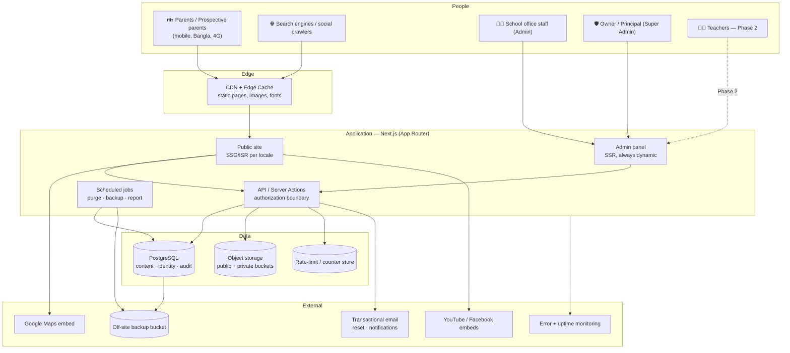
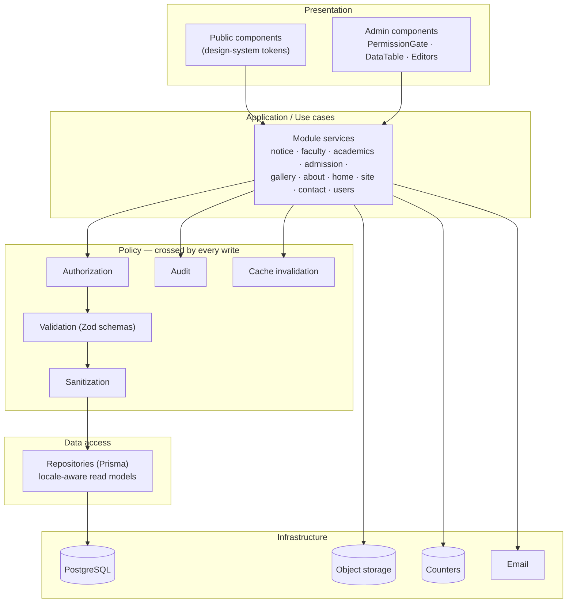
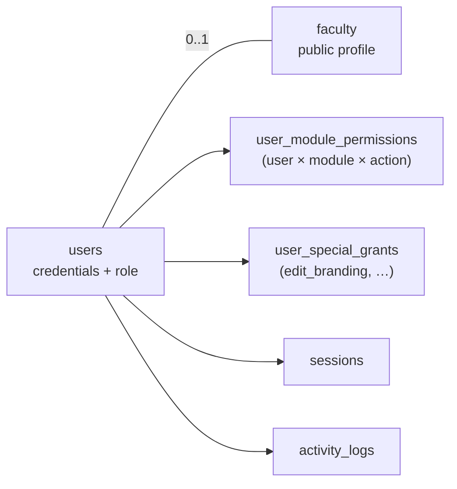
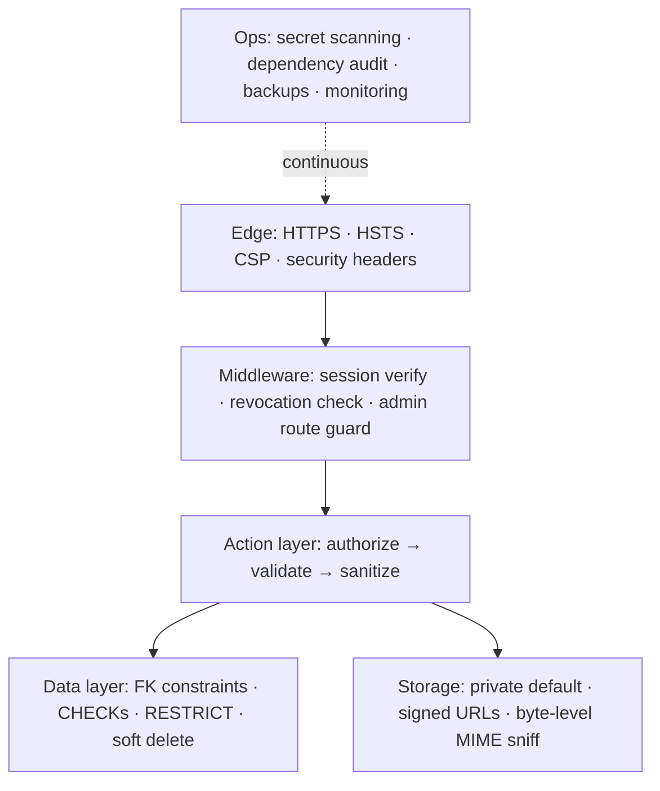

# Shifa International School — System Architecture & Database Design

**Version:** 1.0
**Date:** 14 August 2026
**Domain:** shifaintschool.com
**Status:** Authoritative for technical implementation

> **Document precedence.** This document supersedes `PRD.md` §5 (database schema), §6.3–6.4 (permission model), and §10.1–10.2 (design tokens). `PRD.md` remains authoritative for product scope (§1, §7, §8). `design-system.md` is authoritative for visual design. `school-website-spec-final.md` is authoritative for business intent. `site_map.md` is authoritative for page inventory, with the corrections in ADR-005 and ADR-006.
>
> **Read `AUDIT.md` first** — it explains why several things here differ from the PRD.

> ### 🧭 Building from this document? Do not read it front to back.
>
> This file is a **reference**, not a build order. It is indexed by a resumable task system so that an agent loads only the sections a given task needs.
>
> | File | Role |
> |---|---|
> | **[`build-state.json`](build-state.json)** | **Start here, every session.** ~10KB. Holds the status of all 78 tasks, the resume protocol, and the global stop rules. It is the only place status lives. |
> | **[`BUILD-TRACKER.md`](BUILD-TRACKER.md)** | The task catalogue. One card per task: what to load from this file, where to start, what to touch, **where to stop**, and how to verify. |
> | **This file** | Read only the sections a task card's `Load` line names. |
>
> **To resume work, the entire prompt is:**
> `Read build-state.json and follow its read_order_for_ai. Do exactly one task, then stop.`

---

## Table of Contents

**Part A — System Architecture**
- [A-1. Purpose, Scope & Principles](#a-1-purpose-scope--principles)
- [A-2. Quality Attributes (the 4 E's, made testable)](#a-2-quality-attributes)
- [A-3. Delegation Map (the 4 D's, made operational)](#a-3-delegation-map)
- [A-4. System Context & Containers](#a-4-system-context--containers)
- [A-5. Logical Architecture & Module Boundaries](#a-5-logical-architecture--module-boundaries)
- [A-6. Request Lifecycle](#a-6-request-lifecycle)
- [A-7. Internationalization Architecture](#a-7-internationalization-architecture)
- [A-8. Design System Integration](#a-8-design-system-integration)
- [A-9. Authentication & Authorization](#a-9-authentication--authorization)
- [A-10. Media & File Architecture](#a-10-media--file-architecture)
- [A-11. Caching & Performance](#a-11-caching--performance)
- [A-12. Security Architecture](#a-12-security-architecture)
- [A-13. Verification Architecture (Discernment)](#a-13-verification-architecture)
- [A-14. Environments, CI/CD, Backup & DR](#a-14-environments-cicd-backup--dr)
- [A-15. Observability](#a-15-observability)
- [A-16. Data Protection & Privacy](#a-16-data-protection--privacy)
- [A-17. Phase Roadmap & Extension Points](#a-17-phase-roadmap--extension-points)
- [A-18. Architecture Decision Records](#a-18-architecture-decision-records)
- [A-19. Risk Register](#a-19-risk-register)

**Part B — Database Design (3NF)**
- [B-1. Normalization Approach & Conventions](#b-1-normalization-approach--conventions)
- [B-2. Entity Map](#b-2-entity-map)
- [B-3. Reference & Lookup Tables](#b-3-reference--lookup-tables)
- [B-4. Identity, Sessions & Authorization](#b-4-identity-sessions--authorization)
- [B-5. Media Assets](#b-5-media-assets)
- [B-6. Site Configuration & SEO](#b-6-site-configuration--seo)
- [B-7. Faculty](#b-7-faculty)
- [B-8. Academics](#b-8-academics)
- [B-9. Admission & Fees](#b-9-admission--fees)
- [B-10. Home & About Content](#b-10-home--about-content)
- [B-11. Notices](#b-11-notices)
- [B-12. Gallery](#b-12-gallery)
- [B-13. Contact Messages](#b-13-contact-messages)
- [B-14. Audit Log](#b-14-audit-log)
- [B-15. Normalization Proof](#b-15-normalization-proof)
- [B-16. Documented Exceptions to 3NF](#b-16-documented-exceptions-to-3nf)
- [B-17. Indexes & Query Patterns](#b-17-indexes--query-patterns)
- [B-18. Prisma Mapping Notes](#b-18-prisma-mapping-notes)
- [B-19. Seed Strategy](#b-19-seed-strategy)
- [B-20. Phase 2 Extension Sketch](#b-20-phase-2-extension-sketch)

---
---

# PART A — SYSTEM ARCHITECTURE

## A-1. Purpose, Scope & Principles

### A-1.1 What this system is

A bilingual (Bangla-default, English-secondary) public website and content management system for a K–10 school of ~400 students in Siddhirganj, Narayanganj, operated day-to-day by non-technical school office staff, with no in-house IT support.

That last clause drives more architectural decisions than any other. The system must be **operable by people who did not build it, recoverable by people who do not have a debugger, and safe when misused.**

### A-1.2 Architectural principles

| # | Principle | Consequence |
|---|---|---|
| **P1** | **Content is data, never code.** | Categories, statistics, page metadata, admission steps — all in tables, none in enums or source. Adding a notice category never requires a deploy. |
| **P2** | **The database is the source of truth; the app is replaceable.** | The schema is designed to outlive Next.js. No framework-specific constructs in the data model. |
| **P3** | **Authorization is server-side, always, and fails closed.** | Absence of a permission row means no access. The UI hides things for comfort; the server refuses them for safety. |
| **P4** | **Nothing is deleted, only marked deleted.** | A school with no IT staff will misclick. Every admin-facing delete is reversible for 30 days. |
| **P5** | **Privacy boundaries are physical, not procedural.** | Faculty personal contact details live in a *different table*, so a careless public query cannot reach them. |
| **P6** | **Every language is a row, never a column.** | Adding Arabic is an INSERT, not a migration. |
| **P7** | **Published facts must be attributable.** | Every statistic carries a `verified_on` date. No unverified number renders. |
| **P8** | **Verification is part of the build, not after it.** | Authorization tests, i18n parity, accessibility, and performance budgets gate CI. |

### A-1.3 In scope / out of scope (Phase 1)

**In:** 8 public pages + sub-pages, bilingual, CMS admin panel, Super Admin + Admin with per-module permissions, notice board, gallery, faculty directory, admission info with fees, contact form + inbox, activity audit, SEO, backups.

**Out (designed for, not built):** teacher/student/parent portals, results, attendance, online admission, payments, SMS. Their data-model hooks exist (see A-17, B-20); their code does not.

---

## A-2. Quality Attributes

The 4 E's, expressed as measurable targets. Anything unmeasurable here is a requirement nobody can verify, so every row has a number and a gate.

### Effective — does it achieve the purpose?

| Attribute | Target | Gate |
|---|---|---|
| Bilingual indexability | Both `bn` and `en` versions of every public page indexed with distinct URLs and correct `hreflang` | Pre-launch: Search Console coverage check |
| Content self-service | School staff publish a notice end-to-end with **zero developer involvement**, in Bangla | Pre-launch: observed staff walkthrough |
| Mobile usability | All public flows complete on a 360px viewport | CI: Playwright mobile viewport suite |
| Findability | Any notice from the last 12 months reachable in ≤ 3 taps | Manual acceptance |
| Accessibility | **WCAG 2.2 Level AA**, verified in both locales | CI: `axe-core`, 0 critical/serious |

### Efficient — does it use time, money and bandwidth well?

| Attribute | Target | Gate |
|---|---|---|
| LCP (Bangla homepage) | ≤ 2.5s on mid-range Android, 4G throttled | CI: Lighthouse CI budget |
| CLS | ≤ 0.1 all pages | CI |
| JS shipped, public routes | ≤ 150 KB gzipped per route | CI: bundle-size budget |
| Font payload | ≤ 200 KB total (Bangla **subset**, `font-display: swap`) | CI |
| DB queries per public page render | ≤ 4 (cached renders: 0) | Query-count assertion in tests |
| Public page cache hit rate | ≥ 90% | Runtime metric |
| Infra cost | ≤ $30/month at Phase 1 scale | Budget review |

### Ethical — is it honest and fair to the people in it?

| Attribute | Target | Gate |
|---|---|---|
| No unverified published claims | Every `site_stats` row has `verified_on`; unverified rows do not render | DB constraint + render guard |
| No fabricated content | Placeholder markers (`[[CONTENT REQUIRED]]`) block publish | Publish-gate test |
| Consent recorded | Faculty public profile renders only with `publish_consent_at` and (for photo) `photo_consent_at` | Render guard + test |
| Data minimisation | Contact messages purged at 12 months; audit logs at 24 months | Scheduled job + test |
| Language equity | Admin panel fully available in Bangla | i18n parity test covers admin namespace |
| Transparency | Privacy policy + cookie notice live, bilingual, linked in footer | Pre-launch checklist |

### Safe — does it protect data and resist misuse?

| Attribute | Target | Gate |
|---|---|---|
| Server-side authorization | **Every** mutating endpoint permission-checked; 403 on absence | CI: full authorization matrix suite (~40 tests) |
| Brute force | 5 failures → 15 min lock, keyed on username **and** IP, durable across serverless invocations | Integration test |
| Session integrity | Suspend / delete / password-change revokes sessions **immediately** | Integration test |
| Private files | Non-public media unreachable without a short-lived signed URL | Integration test |
| XSS | All rich text sanitized on write **and** on render, strict allowlist | Unit + payload test suite |
| Recoverability | Daily backup, **restore rehearsed quarterly**, RPO ≤ 24h, RTO ≤ 4h | Documented rehearsal record |
| Destructive-action safety | Soft delete everywhere; structural deletes `RESTRICT`ed with an explanation | Schema constraints + tests |
| Secrets | No credential literal in any repo file or document | CI: secret scan |

---

## A-3. Delegation Map

The single largest gap in the source documents was the absence of a human/AI/system boundary. This is that boundary. **The rule: an AI may build anything whose correctness is checkable from the specification. It may not originate any fact about this school.**

```mermaid
graph LR
    subgraph HUMAN["🧑 Human-only — AI must never originate"]
        H1["Facts about the school<br/>history · vision · mission<br/>principal's message"]
        H2["Numbers<br/>fees · pass rate<br/>student/teacher counts"]
        H3["People<br/>teacher list · committee<br/>consent to publish"]
        H4["Assets<br/>logo · photos · map · Facebook URL"]
        H5["Approvals<br/>security sign-off<br/>accessibility sign-off<br/>go-live"]
    end
    subgraph REVIEW["🤝 AI drafts → human approves"]
        R1["Static UI translations<br/>bn.json / en.json"]
        R2["Admin user manual (Bangla)"]
        R3["Privacy policy / terms<br/>(legal review advised)"]
        R4["SEO meta descriptions"]
    end
    subgraph AI["🤖 AI-buildable — spec-checkable"]
        A1["Schema · migrations · seed"]
        A2["API routes + authorization"]
        A3["Public pages · admin panel"]
        A4["Test suites · CI config"]
        A5["Caching · image pipeline"]
    end
    HUMAN --> REVIEW --> AI
```



### A-3.1 Content Collection Checklist — the missing human work list

Nothing below can be generated. Until each row has a real value from the school, the corresponding section must not render.

| # | Item | Owner | Blocks |
|---|---|---|---|
| 1 | School logo — vector (SVG/AI) + reversed white version | School | Header, footer, favicon, OG image |
| 2 | 3–5 hero photographs (landscape, ≥ 1920px) | School | Homepage |
| 3 | Principal's message, 4–5 paragraphs, **in Bangla**, approved by the principal | Principal | About page |
| 4 | Principal's photograph + consent to publish | Principal | About page |
| 5 | School history — how and by whom it was founded in 2020 | School | About page |
| 6 | Vision statement (1–2 lines) | School | About page |
| 7 | Mission (3–5 points) | School | About page |
| 8 | Managing committee: names + designations (+ photos, + consent) | School | About page |
| 9 | Achievements/recognitions, with years | School | About page |
| 10 | Registration numbers: EMIS code, School Code, BIIN (EIIN 311011906 known) | School office | About page |
| 11 | **Verified** student count, teacher count, pass rate + the date verified | School office | Stats bar — *renders nothing until supplied* |
| 12 | Teacher list: name (BN+EN), designation, subject, qualification, photo, **written consent** | School office | Faculty page |
| 13 | Fee table per class: admission fee, monthly fee, every other charge | School accounts | Admission page |
| 14 | Admission process steps, eligibility ages per class, required documents, key dates | School office | Admission page |
| 15 | Admission form PDF | School office | Admission page |
| 16 | Class routines (PDF per class) | Academic head | Routines page |
| 17 | Academic calendar: holidays + exam periods for the current year | Academic head | Calendar page |
| 18 | Exam schedule for the current term | Academic head | Exams page |
| 19 | Gallery photographs, grouped by event, **with consent for any identifiable student** | School | Gallery |
| 20 | Office phone numbers with labels, official email, office hours | School office | Contact, footer |
| 21 | Google Maps embed URL for the exact location | School | Contact |
| 22 | Facebook page URL (+ YouTube if any) | School | Footer |
| 23 | Domain registrar login, DNS control confirmation | Owner | Deployment |
| 24 | Named account owners: hosting, database, storage, email | Owner | Handover / bus factor |

> **Publish gate.** A page section whose backing content is empty or still carries a `[[CONTENT REQUIRED]]` marker does not render on the public site and cannot be moved to `published`. The site launches smaller and honest rather than complete and fictional.

---

## A-4. System Context & Containers



### A-4.1 Container responsibilities

| Container | Responsibility | Never does |
|---|---|---|
| **CDN / Edge** | Serve pre-rendered locale-specific pages, images, fonts | Hold any authenticated response |
| **Public site** | Render published content per locale; statically generated, revalidated on publish | Query private tables (`faculty_private`, `contact_messages`, `users`) |
| **Admin panel** | Authenticated CMS; server-rendered, `no-store` | Enforce authorization by itself — it only *reflects* it |
| **API / Server Actions** | **The single authorization boundary.** Validate → authorize → mutate → audit → revalidate | Trust any client-supplied role, permission, or user id |
| **Scheduled jobs** | Nightly backup, retention purge, weekly content-freshness report, DB keepalive | Bypass audit logging |
| **PostgreSQL** | All content, identity, permissions, audit | Store file bytes |
| **Object storage** | File bytes in two buckets: `public` (CDN-served) and `private` (signed URLs only) | Serve private objects unsigned |
| **Counter store** | Durable rate-limit windows (login, contact form, upload) | Hold anything that must survive a restart |

> **Deployment note (from AUDIT D-4):** free-tier managed Postgres commonly pauses or deletes inactive projects. A low-traffic school site is exactly that profile. Either budget for a paid tier or run the documented keepalive job — and record the choice. Do not leave it implicit.

---

## A-5. Logical Architecture & Module Boundaries



### A-5.1 The write pipeline — mandatory order

Every mutation, without exception, passes through these six stages in this order. This is the architectural rule that makes the security and audit properties provable rather than hoped-for.

```
1. AUTHENTICATE   valid, non-revoked session  →  else 401
2. AUTHORIZE      user_module_permissions (+ special grants)  →  else 403
3. VALIDATE       Zod schema; reject unknown fields  →  else 422
4. SANITIZE       rich text through strict allowlist
5. PERSIST        single transaction: mutate + write activity_log
6. INVALIDATE     revalidate affected public paths (both locales)
```

Stages 2 and 5 are in the **same transaction**. A write that succeeds without an audit row is impossible.

### A-5.2 Module registry

Each module is a permission unit, a sidebar entry, a set of tables, and a set of public paths to revalidate. Defined once, in the database (`modules`), consumed everywhere.

| Module code | Owns tables | Revalidates | Applicable actions |
|---|---|---|---|
| `site_settings` | site_settings·branding·registrations·contact_channels·social_links·site_stats | all paths | view, edit |
| `home` | hero_slides, home_content, features | `/`, `/en` | view, edit |
| `about` | about_content, committee_members, achievements | `/about`, `/en/about` | view, edit |
| `academics` | academic_years, class_*, subjects, routines, calendar, exams | `/academics/**` | view, add, edit, delete |
| `admission` | admission_*, fee_structures, fee_items | `/admission`, `/en/admission` | view, add, edit, delete |
| `faculty` | faculty, faculty_translations, faculty_private, faculty_subjects | `/faculty`, `/en/faculty` | view, add, edit, delete |
| `notice` | notices, notice_translations, notice_attachments | `/notices/**`, `/` | view, add, edit, delete, **publish** |
| `gallery` | gallery_albums, gallery_photos, gallery_videos | `/gallery`, `/` | view, add, edit, delete |
| `contact` | contact_messages | — | view, delete |
| `media` | media_assets | — | view, add, delete |
| `users` | users, permissions, grants | — | **Super Admin only** |

> Note `publish` as a distinct action on `notice`. This is the mechanism for AUDIT E3-8 (no unreviewed content reaching the public site): a junior admin can be granted `add`+`edit` but not `publish`.

### A-5.3 Boundary rules (enforceable, testable)

1. No public page component may import an admin service.
2. No public read path may reference `faculty_private`, `contact_messages`, `users`, `sessions`, or `activity_logs`. *(Testable by static import analysis.)*
3. Modules never call each other's repositories — they go through services.
4. `PermissionGate` is presentation only. It carries no security meaning and its removal must change nothing about what the server allows.

---

## A-6. Request Lifecycle

### Public page (cache hit — the common case)

```
Request /notices  →  Edge cache HIT  →  pre-rendered Bangla HTML
                                        0 DB queries, 0 server compute
```

### Public page (cache miss / revalidation)

```
Request → middleware: resolve locale from path prefix (never a cookie)
        → server component: repository read (published only, locale + fallback)
        → render with design-system tokens
        → cache at edge, tagged  notice:list , site:settings
```

### Admin mutation

```
POST /admin/notices  (Server Action)
  → middleware: session cookie → sessions.token_hash lookup → revoked_at IS NULL?
  → load user + permission set (single query, request-cached)
  → authorize('notice', 'add')                    ✗ → 403 (logged)
  → Zod validate; strip unknown keys              ✗ → 422
  → sanitize body_html (allowlist)
  → TRANSACTION:
        INSERT notices + notice_translations + notice_attachments
        INSERT activity_logs (actor snapshot, diff)
    COMMIT
  → revalidateTag('notice:list'); revalidatePath('/'); revalidatePath('/en')
  → 200 + toast
```

**Cache tags**, so a single edit does not rebuild the site:

| Tag | Invalidated by |
|---|---|
| `site:settings` | any site_settings module write → **all** pages |
| `notice:list` / `notice:{id}` | notice writes |
| `faculty:list`, `gallery:photos`, `gallery:videos`, `academics:*`, `admission:*`, `home:*`, `about:*` | respective module writes |

---

## A-7. Internationalization Architecture

> Supersedes `PRD.md` §4.1 and `site_map.md` Part 4. Rationale: AUDIT B-3 — cookie-based language on shared URLs makes English permanently unindexable and defeats CDN caching.

### A-7.1 URL strategy — locale-prefixed, Bangla unprefixed

| Locale | Prefix | Example |
|---|---|---|
| Bangla (default) | *(none)* | `/notices` , `/admission` |
| English | `/en` | `/en/notices` , `/en/admission` |
| *(future)* Arabic | `/ar` | `/ar/notices` |

- Existing/printed URLs stay valid — Bangla keeps the bare path.
- `hreflang` alternates now point at genuinely distinct URLs, plus `x-default` → Bangla.
- Every page is statically generatable **per locale** → full edge caching restored.
- A cookie may *remember* preference and redirect **only on a bare-root visit**, never for bot user-agents, never on deep links (a shared `/en/notices/…` link must open in English for everyone).

### A-7.2 Two kinds of translatable text

| Kind | Storage | Who writes it |
|---|---|---|
| **Static UI strings** — nav labels, buttons, form placeholders, admin panel chrome, error messages | `src/i18n/{bn,en}.json`, namespaced (`common`, `public`, `admin`, `errors`) | AI drafts → human reviews |
| **Content** — notices, principal's message, fee labels, teacher names | `*_translations` tables, one row per locale | **Human only** |

> The admin namespace exists because the admin panel is **bilingual**, reversing `site_map.md` Part 4. See ADR-007.

### A-7.3 Fallback policy (closes site_map Open Question #1)

Bangla is **required**. English is **optional but visibly flagged**.

| Situation | Behaviour |
|---|---|
| Bangla missing | Save blocked. Bangla is the required locale. |
| English missing | Save allowed. Admin list shows a persistent `EN missing` badge. |
| English page requests a field with no English row | Falls back to Bangla text, wrapped in `<span lang="bn">` so screen readers switch pronunciation |
| Entire English page has no translated content | Page still renders (nav/footer in English, body Bangla-fallback) and is excluded from the English sitemap until translated |

Rationale: requiring both languages would block a school office from posting an urgent Bangla notice. Silent blank fields would be worse than a language mismatch.

### A-7.4 Locale-aware read model

Repositories take `locale` and return flattened objects, so no page component ever handles translation rows:

```ts
// Conceptual — the repository shape every module follows
async function getNotices(locale: Locale, opts): Promise<NoticeView[]> {
  // 1 query: notices JOIN notice_translations for [locale, fallbackLocale]
  // pick requested locale, else fallback, and mark `isFallback` for lang attrs
}
```

Adding Arabic: `INSERT INTO locales`, add `ar.json`, add `dir="rtl"` handling. **No migration, no schema change, no query rewrite.**

---

## A-8. Design System Integration

> `design-system.md` is authoritative. `PRD.md` §10.1–10.2 is superseded (AUDIT B-4).

### A-8.1 Tokens

All values come from `design-system.md` §10 and are declared once as CSS custom properties, then mapped into Tailwind — no hex literal ever appears in a component.

```css
:root{
  --color-primary:#1E4B3A; --color-primary-hover:#2E6B52;
  --color-ink:#22262A;     --color-ink-muted:#5B6470;
  --color-accent:#B8912F;  --color-accent-tint:#F1E4C2;
  --color-teal:#3A7A72;    --color-khaki:#DCCFA8;
  --color-surface:#FFFFFF; --color-surface-alt:#FAF7F0; --color-border:#EDE9DD;
  --color-success:#3E8E5A; --color-danger:#B3413A;
}
```

### A-8.2 Typography — the Bangla gap closed

`design-system.md` names no Bangla typeface, yet Bangla is the default language (AUDIT B-4). Playfair Display and Source Sans 3 have **zero Bangla coverage**. Pairing added:

| Role | Latin | Bangla | Notes |
|---|---|---|---|
| Headings | Playfair Display 600–700 | **Tiro Bangla** (or Noto Serif Bengali) | Serif↔serif; matches the formal tone |
| Body | Source Sans 3 400/600 | **Hind Siliguri** (or Noto Sans Bengali) | High legibility at small sizes |

```css
--font-heading: "Playfair Display","Tiro Bangla",Georgia,serif;
--font-body:    "Source Sans 3","Hind Siliguri","Segoe UI",sans-serif;
```

Script-based fallback in one stack, because BN/EN mix inside single strings is unavoidable ("Class 10", "EIIN 311011906", the school name).

**Bangla-specific rules:**
- Body minimum **17px** in Bangla (vs 16px Latin) — the *matra* and conjunct density reduce legibility at equal size.
- Line-height 1.75 in Bangla (vs 1.6) to clear ascenders/descenders.
- **Subset Bangla webfonts** to the actual glyph range and preload only the body weight — unsubsetted Bangla families exceed 300 KB each and would blow the ≤200 KB font budget on the majority-language experience.
- Re-verify `design-system.md` §9 contrast ratios against Bangla renderings; Muted Gold on white already fails small-text AA and must remain icons/large-text only.

### A-8.3 Layout accommodation

Bangla runs roughly 15–30% longer than equivalent English. Every component is built to the **Bangla** string length, then verified in English — never the reverse. No fixed-width buttons, no single-line-assumed nav items, no truncation without a title attribute.

---

## A-9. Authentication & Authorization

> Supersedes `PRD.md` §6.3–6.4. Resolves AUDIT B-1 and B-2.

### A-9.1 One identity table for every human

`Faculty.password` as a second credential store (PRD §5) is removed. **All credentials live in `users`.** A faculty member optionally links to a user account via `faculty.user_id`. One hashing path, one lockout policy, one reset flow, one place to audit. (AUDIT S-2.)



### A-9.2 Authentication

| Aspect | Decision |
|---|---|
| Login | `/login` — **username or email** + password. **No role selector** (AUDIT S-8): role comes from credentials, and a selector leaks which portals exist. |
| Hashing | bcrypt cost 12 (raise as hardware allows) |
| Session | Opaque random token in an HTTP-only, `Secure`, `SameSite=Lax` cookie. **Only the SHA-256 hash is stored** in `sessions`. |
| Lifetime | 8h idle / 24h absolute (tightened from PRD's 24h idle — this panel holds parents' contact data) |
| Revocation | `sessions.revoked_at`. Set on logout, suspend, delete, password change, and role change. Checked on every request. (AUDIT S-7.) |
| Reset | `password_reset_tokens`: single-use, 30-min TTL, hashed at rest, emailed. Requires `users.email` — absent in PRD §5, which made reset impossible (AUDIT S-4). |
| First login | `must_change_password` forces rotation before any other action. Seed password is generated at seed time and printed once — **never a literal in a document** (AUDIT S-12). |
| Brute force | `login_attempts` + `rate_limit_counters` in Postgres. 5 failures in 15 min → 15 min lock, keyed on **username AND IP**. Durable across serverless invocations, unlike the in-memory approach implied by PRD §13 (AUDIT S-1). |

### A-9.3 Authorization model — independent toggles, restored

The original spec's model wins (AUDIT B-1). `AccessLevel` cascade is removed because it cannot express the spec's own worked example (Add + Delete without Edit).

```
GRANTED  ⟺  a row exists in user_module_permissions (user_id, module_code, action_code)
```

- **No row = no access.** Fails closed. A new admin sees nothing.
- Actions are rows in `permission_actions`, not code — adding `publish` or `export` later is an INSERT.
- `module_actions` declares which actions are *applicable* per module, which drives the `—` cells in the admin matrix UI instead of hardcoding them.
- `modules.code` and `permission_actions.code` are **foreign keys**, so a typo is a database error, not a silent permission hole (AUDIT S-3).

```ts
// Conceptual authorization check — server-side only
async function can(user: SessionUser, module: string, action: Action) {
  if (!user.isActive) return false;                 // suspended = no access
  if (user.role === 'super_admin') return true;     // documented bypass
  return user.permissions.has(`${module}:${action}`); // loaded once per request
}
```

### A-9.4 Protected branding — `edit_branding`

Replaces the undefined `canEditBranding` of PRD §6.4.1 (AUDIT B-2) with a real, stored, extensible grant, and backs it with a **physical table boundary** rather than a column-level `if`:

| Data | Table | Who may edit |
|---|---|---|
| School name, logo, favicon, wordmark | `site_branding` | Super Admin, **or** an admin holding the `edit_branding` special grant |
| Address, phones, email, office hours, socials, statistics, map | `site_settings` + children | Any admin with `site_settings:edit` |

Granting `site_settings:edit` therefore **cannot** unlock branding — the two live in different tables behind different checks. That was the stated intent of PRD §6.4.1, which §8.3 then contradicted.

`special_grants` is a lookup table, so future protected capabilities (`export_data`, `purge_deleted`, `manage_backups`) are INSERTs.

### A-9.5 Role summary

| Role | Phase | Authorization |
|---|---|---|
| `super_admin` | 1 | Bypasses all checks. Sole manager of users, permissions, grants. |
| `admin` | 1 | Exactly the rows in `user_module_permissions` + `user_special_grants`. |
| `faculty` | 2 | Own profile fields only; ownership check on every request. |
| `student` / `guardian` | 2 | Own (or own child's) records only — see A-17.2. |

---

## A-10. Media & File Architecture

PRD §5 stores files as bare URL strings on ~12 models. That yields no alt text, no orphan detection, no reuse, no access control, and no dimensions for layout stability (AUDIT A-3, S-5).

### A-10.1 Central registry

Every file is a row in `media_assets`; every consumer holds a `media_id` foreign key. This gives, in one move: **translatable alt text** (accessibility + i18n), width/height (prevents CLS), checksum-based deduplication, orphan detection, per-file access control, and a single deletion path.

### A-10.2 Two buckets

| Bucket | Contents | Access |
|---|---|---|
| `public` | Logo, hero, gallery, faculty photos, notice attachments, routine PDFs, admission form | CDN, immutable, content-hashed keys |
| `private` | Anything internal; **all Phase 2 student documents** | Signed URLs, 15-min TTL, never CDN-cached |

Default is **private**; publication is an explicit act. This is P5 (privacy boundaries are physical) applied to files.

### A-10.3 Upload pipeline

```
receive → size cap by type → sniff MIME from FILE BYTES (not extension, not header)
        → reject on mismatch → strip EXIF (GPS in a photo of a school is a real risk)
        → randomized storage key (never the user's filename)
        → images: resize ≤1920px, generate 400px + 800px, encode AVIF + WebP + fallback
        → checksum → dedupe → INSERT media_assets → audit
```

Limits: images 5 MB (JPEG/PNG/WebP/AVIF), PDFs 10 MB. Enforced **server-side**; client limits are a courtesy. Videos are never uploaded — only provider embeds (`gallery_videos`).

### A-10.4 Deletion

Soft delete first. A weekly job hard-deletes storage objects for assets soft-deleted >30 days ago **and referenced by nothing**. Orphan detection is possible only because of the registry.

---

## A-11. Caching & Performance

| Layer | Strategy |
|---|---|
| Public pages | Static generation **per locale**, ISR with on-demand revalidation by cache tag on admin save. Steady state: 0 DB queries per public request. |
| Admin pages | `no-store`, always dynamic. |
| Images | Content-hashed, `immutable`, 1-year cache; responsive `srcset`; AVIF→WebP→JPEG; `loading="lazy"` below the fold; explicit width/height from `media_assets`. |
| Fonts | Self-hosted, **subset**, `preload` body weight only, `font-display: swap`. Bangla subsetting is the single biggest payload win available. |
| Data | Per-request memoization of `site_settings` and the permission set (each loaded once, not per component). |
| Lists | Server-side pagination + search on **every** admin list from day one (AUDIT E-2). |
| Queries | Explicit `select` shapes per read model; no `include` cascades. Query-count assertions in tests prevent N+1 regressions. |

**Why this matters here:** the audience is on mid-range Android over mobile data in Narayanganj, and the database is likely a free/low tier. Serving pre-rendered HTML from the edge is what makes both constraints survivable.

---

## A-12. Security Architecture

Layered, with the properties from A-2 mapped to concrete mechanisms.



| Control | Implementation |
|---|---|
| Transport | HTTPS enforced, HSTS with preload |
| CSP | Strict; `frame-src` allowlist for YouTube/Facebook/Google Maps only; no `unsafe-inline` scripts |
| Headers | `X-Content-Type-Options`, `Referrer-Policy: strict-origin-when-cross-origin`, `Permissions-Policy` minimal |
| CSRF | Framework tokens on all mutations + `SameSite=Lax` (AUDIT S-10) |
| XSS | `sanitize-html` server-side allowlist on **write**, DOMPurify on **render**. Stored HTML is never trusted twice. (AUDIT S-9) |
| SQL injection | Parameterized via Prisma; raw SQL only in reviewed, parameterized migrations |
| Authorization | A-9.3; every endpoint; tested by the A-13 matrix |
| Rate limiting | Durable counters: login (5/15min per user+IP), contact (3/hour per IP), upload (20/hour per user) |
| File safety | A-10.3 |
| Secrets | Environment only; CI secret scanning; no credential literal in any repo file **or document** |
| Dependencies | Committed lockfile, `npm audit` in CI, Dependabot, monthly review (AUDIT S-13) |
| Audit | Immutable `activity_logs`; actor snapshot survives user deletion (AUDIT S-6) |
| Destructive ops | Soft delete + `ON DELETE RESTRICT` on structural relations. Deleting a class with fee history is **refused with an explanation**, never silently cascaded (AUDIT S-11) |

---

## A-13. Verification Architecture

> This section addresses the largest gap in the source documents: `PRD.md` §16 offers four manual checkboxes as the entire verification strategy for a permission system (AUDIT D-3). **Discernment is what makes AI-built software trustworthy** — code that looks correct is the default output, so correctness must be demonstrated, not assumed.

### A-13.1 Test pyramid

| Level | Coverage | Gate |
|---|---|---|
| **Unit** | permission resolution, locale fallback, sanitization, validation schemas, slug generation, fee computation | every PR |
| **Integration (DB)** | repositories against a real Postgres; constraints, cascades, soft delete, singleton guards, retention job | every PR |
| **Authorization matrix** | **the critical suite** — see A-13.2 | every PR, blocking |
| **E2E (Playwright)** | golden paths, both locales, desktop + 360px mobile | every PR |
| **Non-functional** | Lighthouse budgets, `axe-core` a11y, bundle size, i18n key parity | every PR, blocking |

### A-13.2 Authorization matrix suite — non-negotiable

For **every** mutating endpoint, automated assertions:

| Case | Expected |
|---|---|
| No session | `401` |
| Valid session, **no** permission row for the module | `403` |
| Correct module, **wrong action** (e.g. `view` only, attempts `delete`) | `403` |
| Adjacent module's permission only | `403` |
| **Suspended** user with a previously-valid session | `401`, session revoked |
| Correct permission | `2xx` **and** an `activity_logs` row written |
| Non-super-admin hits `/api/admin/users/*` | `403` |
| Admin with `site_settings:edit` but **no** `edit_branding` attempts a school-name change | `403` |
| Admin **with** `edit_branding` performs the same change | `2xx` |
| Public endpoint response body contains a `faculty_private` field | **test fails** |

~40 tests. Their absence is the difference between "we believe the permissions work" and "we know."

### A-13.3 Content & ethics gates (automated)

| Gate | Fails when |
|---|---|
| Placeholder guard | Any `[[CONTENT REQUIRED]]` marker reaches `status = 'published'` |
| Statistic honesty | A `site_stats` row without `verified_on` renders publicly |
| Consent guard | A faculty profile renders without `publish_consent_at` (or a photo without `photo_consent_at`) |
| i18n parity | A key exists in `bn.json` but not `en.json` (or vice versa) in any namespace, **including admin** |
| Private-data leakage | Static import analysis finds a public route importing a private repository |
| Retention | The purge job leaves contact messages older than 12 months |

### A-13.4 Definition of Done (per module)

A module is done when: acceptance criteria written as Given/When/Then are green · authorization matrix passes · both locales render including fallback · soft delete + restore verified · audit rows written for every mutation · admin list paginates and searches · a11y clean in both locales · public path revalidates on save · Bangla-length layout verified at 360px.

### A-13.5 Pre-launch human gates

Not automatable, and not skippable: security review sign-off · manual accessibility pass with a screen reader in **both** languages · **restore rehearsal from a real backup** · content verification (every published fact traced to a source and date) · staff walkthrough — an office member publishes a notice unaided, in Bangla · privacy policy live · super-admin password rotated and account owners recorded.

---

## A-14. Environments, CI/CD, Backup & DR

### A-14.1 Environments

| Env | Purpose | Data |
|---|---|---|
| **Local** | Development | Seeded synthetic; never production data |
| **Staging** | Migration rehearsal, review, acceptance | Anonymized copy — contact messages and faculty personal fields scrubbed |
| **Production** | Live | Real |

### A-14.2 Pipeline

```
PR → lint · typecheck · unit · integration · AUTHORIZATION MATRIX · e2e
   → a11y · lighthouse budgets · bundle budget · i18n parity · secret scan
   → preview deploy
merge to main → migrate STAGING → smoke → manual approval → migrate PROD → deploy → smoke → tag
```

Migrations are forward-only and backward-compatible (expand → migrate → contract), so a rollback of application code never strands the database.

### A-14.3 Backup & disaster recovery

The source documents contain no backup plan at all. This is the minimum for a system holding a school's entire public content and its parents' contact data.

| Aspect | Policy |
|---|---|
| Database | Nightly `pg_dump` → off-site bucket, **encrypted**. Retain 7 daily + 4 weekly + 3 monthly. |
| Object storage | Versioning on; lifecycle rules for soft-deleted objects |
| **RPO / RTO** | ≤ 24 h data loss / ≤ 4 h to restore |
| **Restore rehearsal** | **Quarterly, into staging, recorded.** An untested backup is not a backup. |
| Access recovery | Domain, hosting, DB and storage account owners documented with a named deputy — the bus-factor gap in AUDIT D-1 |
| Free-tier risk | If a free DB tier is used, run a keepalive job and accept the pause/deletion risk **in writing** |

---

## A-15. Observability

| Signal | Tool | Alert |
|---|---|---|
| Uptime | External monitor, 5-min interval | 2 consecutive failures → owner |
| Errors | Sentry (free tier) | New error type, or >10/hour |
| Auth anomalies | `login_attempts` query | >20 failures/hour for one username |
| Backups | Job status | Any failure → immediate |
| Performance | Lighthouse CI trend | Budget regression on main |
| **Content freshness** | Weekly automated email to the principal | No notice in 30 days; unread messages >7 days old; sections still holding placeholders |

That last row is deliberate: the most likely real-world failure of a school website is not a crash — it is quietly going stale until parents stop trusting it.

---

## A-16. Data Protection & Privacy

Absent entirely from the source documents (AUDIT E3). Phase 1 already collects personal data from parents; Phase 2 will hold records about minors. The design must exist before the schema does.

### A-16.1 Data inventory

| Data | Subject | Basis | Retention | Visible to |
|---|---|---|---|---|
| Contact form: name, phone, email, message | Parent/visitor | Consent at submission | **12 months**, auto-purge | Admins with `contact:view` |
| Faculty public profile | Teacher | Recorded consent | While employed + 30 days | Public |
| Faculty personal phone/email/joining date | Teacher | Employment | Employment + 12 months | Super Admin only |
| Gallery photographs | Students, staff | Recorded consent | Until withdrawn | Public |
| Admin accounts | Staff | Employment | Employment + 30 days (audit snapshot persists) | Super Admin |
| Activity log | Admins | Legitimate interest | **24 months** | Super Admin |
| **Phase 2:** results, attendance, guardians | **Minors** | Contract + guardian consent | See A-16.3 | Strictly scoped |

### A-16.2 Phase 1 requirements

1. **Privacy policy** and **cookie notice**, bilingual, linked in the footer — added to the sitemap (missing from `site_map.md`).
2. **Consent at the form**: an explicit statement of what is collected, why, and for how long, next to the submit button.
3. **Consent fields on faculty** (`publish_consent_at`, `photo_consent_at`) — a profile does not render without them.
4. **Automated purge** of contact messages at 12 months, audit logs at 24 months, verified by test.
5. **Data-subject requests**: a documented procedure for a person asking what is held and requesting deletion.
6. **Physical separation** of faculty private data (`faculty_private`) from public data — a public query cannot reach a table it does not join.

### A-16.3 Phase 2 invariants — write them now, they constrain the schema

1. Every read of a student record is authorized against the **requesting user's relationship to that student**, server-side, on every request. No exceptions, no caching of the decision.
2. **No endpoint ever returns a list of other students' results.** Not paginated, not filtered, not "for convenience."
3. Every access to a student record is written to an access log with actor, subject, and timestamp.
4. Results and attendance are scoped to an `academic_year_id` — never "current" implicitly.
5. Guardian↔student links are explicit rows, verified by the school, revocable.
6. Withdrawal triggers a defined retention countdown, not indefinite storage.
7. Public pages **never** render any student-identifying data. There is no such thing as a public result list.

---

## A-17. Phase Roadmap & Extension Points

### A-17.1 Phasing

| Phase | Scope | Enabled by |
|---|---|---|
| **1 (now)** | Public site + CMS + Super Admin/Admin | This document |
| **2a** | Faculty login, self-service profile edit | `users.role='faculty'`, `faculty.user_id` already exist |
| **2b** | Students, guardians, sections, attendance | `class_sections`, `academic_years` already exist |
| **2c** | Results | `exams`, `exam_terms` already exist |
| **2d** | Online admission | `admission_cycles` already exists |
| **3** | Payments, SMS/email notifications | New modules; identity and audit reused |

### A-17.2 Extension points already built into Phase 1

| Extension | Why it is already possible |
|---|---|
| A third language (Arabic) | `locales` is a table; translations are rows (P6) |
| A new notice/gallery category | Lookup tables, admin-managed (P1) |
| A new permission action (`publish`, `export`) | `permission_actions` + `module_actions` are rows |
| A new protected capability | `special_grants` is a lookup |
| Per-section routines, teachers, attendance | `class_sections` exists as real rows, not a count |
| Year-over-year fee/exam history | Everything time-varying carries `academic_year_id` |
| Faculty login | One `users` table; no second credential store to reconcile |
| New fee types (transport, lab, session) | `fee_items` + `fee_types`, no schema change |
| Multiple attachments per notice | `notice_attachments` is a child table |
| Per-page SEO editing | `pages` + `page_translations` |

**These ten items are exactly what the PRD's schema made expensive.** Cost of building them in now: near zero. Cost of retrofitting: a migration touching most of the database plus every query.

---

## A-18. Architecture Decision Records

| # | Decision | Rejected alternative | Rationale |
|---|---|---|---|
| **ADR-001** | **Translation tables**, one row per (entity, locale) | `*En`/`*Bn` column pairs (PRD §5) | ~90 duplicated columns across 25 tables; a third language would need a migration touching all of them. Column pairs are a repeating group and are not normalized. |
| **ADR-002** | **Lookup tables** for categories, event types, fee types, designations, statuses | Prisma enums (PRD §5) | Enums require a migration + redeploy to add a category, contradicting PRD §1.1's own "no code changes to update content" principle. |
| **ADR-003** | **Independent action toggles** via a junction table | Cascading `AccessLevel` enum (PRD §5/§6.3) | The cascade cannot express the spec's own example (Add+Delete without Edit). Junction is more expressive, properly normalized, and extensible to new actions. |
| **ADR-004** | **One `users` table** for all humans; faculty optionally linked | Separate `Faculty.password` (PRD §5) | Two credential stores means two hashing paths, two lockout policies, two reset flows — twice the attack surface for no benefit. |
| **ADR-005** | **Locale-prefixed URLs** (`/` = BN, `/en/` = EN) | Cookie-based locale on shared URLs (PRD §4.1, site_map Part 4) | Shared URLs make English permanently unindexable and make `hreflang` meaningless; cookie-varying responses defeat CDN caching. |
| **ADR-006** | **`/gallery` with query filters**; keep 3 Academics sub-pages | `/gallery/photos` + `/gallery/videos` as routes | Closes site_map Open Question #2 — PRD §7.8 specified tabs while §3 created routes. One route, no dead pages, shareable filter URLs. Academics sub-pages stay: parents deep-link routines and exam schedules. |
| **ADR-007** | **Bilingual admin panel** | English-only admin (site_map Part 4) | The operators are Bangla-speaking school office staff. An unusable CMS is an unused CMS. Marginal cost: one extra JSON namespace on i18n machinery already being built. |
| **ADR-008** | **Soft delete + `RESTRICT` on structural relations** | Hard delete with cascades (PRD §5) | Non-technical operators will misclick. Deleting one `ClassGrade` currently destroys its subjects, routines, exams and entire fee history silently. |
| **ADR-009** | **Central `media_assets` registry** | Bare URL strings on ~12 models | Enables translatable alt text (a11y), CLS-preventing dimensions, orphan cleanup, dedupe, and private-by-default access control. |
| **ADR-010** | **`academic_years` as a first-class entity** | Implicit "current year" | Without it, next year's fees overwrite this year's with no history, and no Phase 2 record can be year-scoped. |
| **ADR-011** | **Audit actor snapshot; `ON DELETE SET NULL`** | `onDelete: Cascade` (PRD §5) | An audit trail that vanishes when you delete the actor is not an audit trail. See B-16 for the deliberate normalization exception. |
| **ADR-012** | **`design-system.md` authoritative + Bangla type pairing added** | PRD §10 palette/fonts | Two competing design systems; the PRD's fonts have no Bangla coverage for the default language. |
| **ADR-013** | **Bangla required, English optional with visible flag** | Both languages mandatory (PRD §4.2) | Closes site_map Open Question #1. Mandatory English blocks urgent Bangla notices; blank English fields are worse than a flagged fallback. |
| **ADR-014** | **Durable rate limiting** in Postgres/KV | In-memory (implied by PRD §13) | Serverless invocations do not share memory — the specified brute-force protection would silently not exist. |

---

## A-19. Risk Register

| # | Risk | L | I | Mitigation |
|---|---|---|---|---|
| R1 | **Content never arrives**; site launches with placeholders or fabrications | High | High | A-3.1 checklist with named owners; publish gate blocks placeholders; launch smaller and honest |
| R2 | Staff cannot use the admin panel → site goes stale | High | High | Bilingual admin (ADR-007); Bangla manual; observed walkthrough gate; weekly freshness email |
| R3 | Free-tier database paused/deleted | Medium | High | Keepalive job + nightly off-site backup + budget for a paid tier |
| R4 | Permission bug exposes contact messages or admin functions | Medium | High | Fail-closed model; A-13.2 matrix suite; FK-constrained module/action codes |
| R5 | Accidental destructive delete by an operator | Medium | High | Soft delete; `RESTRICT` on structural relations; 30-day restore; confirmation naming the child records at risk |
| R6 | English content never indexed | *(was High)* | High | ADR-005 locale-prefixed URLs |
| R7 | Bangla fonts blow the mobile performance budget | Medium | Medium | Subsetting, `swap`, preload one weight, CI budget |
| R8 | Phase 2 student data mishandled | Medium | **Critical** | A-16.3 invariants written now and binding on the schema |
| R9 | Bus factor — single person holds all account access | High | High | Named owners + deputies documented at launch (A-14.3) |
| R10 | Faculty personal data leaks via a public endpoint | Low | High | `faculty_private` physical separation; leakage test in CI |
| R11 | Backup exists but restore fails | Medium | **Critical** | Quarterly rehearsed restore into staging, recorded |
| R12 | Photos of identifiable students published without consent | Medium | High | Consent recorded per asset; render guard; documented takedown path |

---
---

# PART B — DATABASE DESIGN (3NF)

## B-1. Normalization Approach & Conventions

### B-1.1 Target: Third Normal Form, with documented exceptions

Every table below satisfies:

| Form | Requirement | How it is met here |
|---|---|---|
| **1NF** | Atomic values; no repeating groups; no arrays-as-columns | No `phone1`/`phone2`, no `*En`/`*Bn` pairs, no `otherCharges` single-slot. Each becomes a child table. |
| **2NF** | 1NF + every non-key attribute depends on the **whole** primary key | Checked on all composite-key tables (translations, junctions). Attributes depending on only part of a key were moved out — see the worked example in B-1.4. |
| **3NF** | 2NF + no non-key attribute depends on another non-key attribute | No derived or lookup-duplicated values stored alongside their determinant. Two deliberate exceptions are documented in B-16. |

### B-1.2 Conventions

| Convention | Rule |
|---|---|
| Naming | `snake_case`, plural tables, singular column names |
| Primary key | `id BIGINT GENERATED ALWAYS AS IDENTITY` |
| Public identifier | `uid UUID` on entities exposed in URLs/APIs (`users`, `faculty`, `notices`, `media_assets`, `contact_messages`) — prevents enumeration, matters for Phase 2 |
| Lookups | Natural `TEXT` primary key (`code`) — readable in queries, FK-enforced, stable |
| Translations | `{entity}_translations`, PK `(entity_id, locale_code)`, `ON DELETE CASCADE` (existentially dependent — correct use of cascade) |
| Junctions | PK on the full column set |
| Timestamps | `TIMESTAMPTZ`, always. `created_at`, `updated_at` |
| Soft delete | `deleted_at TIMESTAMPTZ`, `deleted_by_user_id`. Partial indexes exclude deleted rows |
| Money | `NUMERIC(12,2)` — never float |
| Singletons | `id SMALLINT PRIMARY KEY DEFAULT 1 CHECK (id = 1)` — enforced by the database, not by convention |
| Structural FKs | `ON DELETE RESTRICT` (default). `CASCADE` only for existentially-dependent children (translations, attachments). `SET NULL` for audit actors |

### B-1.3 The translation pattern

```sql
CREATE TABLE <entity>_translations (
    <entity>_id  BIGINT NOT NULL REFERENCES <entity>(id) ON DELETE CASCADE,
    locale_code  TEXT   NOT NULL REFERENCES locales(code) ON UPDATE CASCADE,
    -- translatable columns only
    PRIMARY KEY (<entity>_id, locale_code)
);
```

Every translatable attribute depends on **both** the entity and the locale — the full composite key. That is 2NF satisfied by construction, and it is precisely why `*En`/`*Bn` column pairs are not normalized: they encode part of the key (the locale) in the column *name*.

### B-1.4 Worked example — a 2NF violation caught during design

An early draft of `fee_items` was:

```sql
fee_items(fee_structure_id, fee_type_code, amount, is_recurring_monthly, sort_order)
```

`is_recurring_monthly` depends on `fee_type_code` **alone**, not on the whole key — a monthly fee is monthly regardless of which class it belongs to. Storing it here would let the same fee type be marked recurring for Class 3 and non-recurring for Class 4: an update anomaly.

**Resolution:** `is_recurring_monthly` and `sort_order` moved to `fee_types`. Only `amount` — genuinely dependent on (structure, type) together — remains. Applied below.

---

## B-2. Entity Map

```mermaid
erDiagram
    LOCALES ||--o{ TRANSLATIONS : "every *_translations"
    USERS ||--o{ USER_MODULE_PERMISSIONS : has
    USERS ||--o{ USER_SPECIAL_GRANTS : has
    USERS ||--o{ SESSIONS : has
    USERS ||--o{ ACTIVITY_LOGS : "actor (SET NULL)"
    USERS ||--o| FACULTY : "may link"
    MODULES ||--o{ MODULE_ACTIONS : declares
    PERMISSION_ACTIONS ||--o{ MODULE_ACTIONS : declares
    MODULES ||--o{ USER_MODULE_PERMISSIONS : scopes
    MEDIA_ASSETS ||--o{ MEDIA_ASSET_TRANSLATIONS : "alt text"
    ACADEMIC_YEARS ||--o{ CLASS_SECTIONS : scopes
    ACADEMIC_YEARS ||--o{ FEE_STRUCTURES : scopes
    ACADEMIC_YEARS ||--o{ EXAM_TERMS : scopes
    ACADEMIC_YEARS ||--o{ CALENDAR_EVENTS : scopes
    ACADEMIC_YEARS ||--o{ ADMISSION_CYCLES : scopes
    CLASS_GRADES ||--o{ CLASS_SECTIONS : has
    CLASS_GRADES ||--o{ CLASS_SUBJECTS : teaches
    SUBJECTS ||--o{ CLASS_SUBJECTS : "taught in"
    CLASS_GRADES ||--o{ FEE_STRUCTURES : priced_by
    FEE_STRUCTURES ||--o{ FEE_ITEMS : contains
    FEE_TYPES ||--o{ FEE_ITEMS : types
    EXAM_TERMS ||--o{ EXAMS : contains
    CLASS_GRADES ||--o{ EXAMS : for
    FACULTY ||--o| FACULTY_PRIVATE : "1:1 isolated"
    FACULTY ||--o{ FACULTY_SUBJECTS : teaches
    NOTICE_CATEGORIES ||--o{ NOTICES : categorizes
    NOTICES ||--o{ NOTICE_ATTACHMENTS : has
    GALLERY_CATEGORIES ||--o{ GALLERY_ALBUMS : categorizes
    GALLERY_ALBUMS ||--o{ GALLERY_PHOTOS : contains
```



---

## B-3. Reference & Lookup Tables

```sql
-- ─────────────────────────────────────────────────────────────
-- LOCALES — adding a language is an INSERT, never a migration
-- ─────────────────────────────────────────────────────────────
CREATE TABLE locales (
    code          TEXT        PRIMARY KEY,           -- 'bn', 'en', future 'ar'
    name_native   TEXT        NOT NULL,              -- 'বাংলা', 'English'
    name_en       TEXT        NOT NULL,
    direction     TEXT        NOT NULL DEFAULT 'ltr'
                              CHECK (direction IN ('ltr','rtl')),
    url_prefix    TEXT        NOT NULL DEFAULT '',   -- '' for default, 'en' otherwise
    is_default    BOOLEAN     NOT NULL DEFAULT FALSE,
    is_active     BOOLEAN     NOT NULL DEFAULT TRUE,
    sort_order    SMALLINT    NOT NULL DEFAULT 0
);
-- Exactly one default locale, enforced by the database
CREATE UNIQUE INDEX ux_locales_single_default ON locales (is_default) WHERE is_default;
CREATE UNIQUE INDEX ux_locales_prefix         ON locales (url_prefix);

-- ─────────────────────────────────────────────────────────────
-- ROLES / MODULES / ACTIONS  — the authorization vocabulary
-- ─────────────────────────────────────────────────────────────
CREATE TABLE roles (
    code            TEXT     PRIMARY KEY,   -- super_admin, admin, faculty, student, guardian
    is_staff        BOOLEAN  NOT NULL DEFAULT FALSE,
    bypasses_checks BOOLEAN  NOT NULL DEFAULT FALSE,  -- TRUE only for super_admin
    sort_order      SMALLINT NOT NULL DEFAULT 0
);

CREATE TABLE role_translations (
    role_code   TEXT NOT NULL REFERENCES roles(code)   ON UPDATE CASCADE ON DELETE CASCADE,
    locale_code TEXT NOT NULL REFERENCES locales(code) ON UPDATE CASCADE,
    name        TEXT NOT NULL,
    PRIMARY KEY (role_code, locale_code)
);

CREATE TABLE modules (
    code               TEXT     PRIMARY KEY,   -- home, about, academics, …, users
    icon               TEXT,
    admin_path         TEXT     NOT NULL,
    is_super_admin_only BOOLEAN NOT NULL DEFAULT FALSE,  -- 'users'
    sort_order         SMALLINT NOT NULL DEFAULT 0,
    is_active          BOOLEAN  NOT NULL DEFAULT TRUE
);

CREATE TABLE module_translations (
    module_code TEXT NOT NULL REFERENCES modules(code) ON UPDATE CASCADE ON DELETE CASCADE,
    locale_code TEXT NOT NULL REFERENCES locales(code) ON UPDATE CASCADE,
    name        TEXT NOT NULL,
    description TEXT,
    PRIMARY KEY (module_code, locale_code)
);

CREATE TABLE permission_actions (
    code       TEXT     PRIMARY KEY,   -- view, add, edit, delete, publish
    sort_order SMALLINT NOT NULL DEFAULT 0
);

CREATE TABLE action_translations (
    action_code TEXT NOT NULL REFERENCES permission_actions(code) ON UPDATE CASCADE ON DELETE CASCADE,
    locale_code TEXT NOT NULL REFERENCES locales(code)            ON UPDATE CASCADE,
    name        TEXT NOT NULL,
    PRIMARY KEY (action_code, locale_code)
);

-- Which actions are APPLICABLE to which module.
-- This drives the "—" cells in the admin permission matrix instead of
-- hardcoding them in the frontend (see AUDIT B-1).
CREATE TABLE module_actions (
    module_code TEXT NOT NULL REFERENCES modules(code)            ON UPDATE CASCADE ON DELETE CASCADE,
    action_code TEXT NOT NULL REFERENCES permission_actions(code) ON UPDATE CASCADE ON DELETE CASCADE,
    PRIMARY KEY (module_code, action_code)
);

-- Protected capabilities kept OFF the normal module cascade (AUDIT B-2)
CREATE TABLE special_grants (
    code        TEXT PRIMARY KEY,   -- edit_branding, export_data, purge_deleted, manage_backups
    description TEXT NOT NULL
);

-- ─────────────────────────────────────────────────────────────
-- CONTENT LIFECYCLE
-- ─────────────────────────────────────────────────────────────
CREATE TABLE content_statuses (
    code       TEXT     PRIMARY KEY,   -- draft, published, archived
    is_public  BOOLEAN  NOT NULL DEFAULT FALSE,
    sort_order SMALLINT NOT NULL DEFAULT 0
);

-- ─────────────────────────────────────────────────────────────
-- CATEGORY LOOKUPS — admin-managed, no migration to extend (ADR-002)
-- ─────────────────────────────────────────────────────────────
CREATE TABLE notice_categories (
    id         BIGINT GENERATED ALWAYS AS IDENTITY PRIMARY KEY,
    code       TEXT     NOT NULL UNIQUE,   -- general, admission, exam, holiday, result…
    color_hex  TEXT     CHECK (color_hex ~ '^#[0-9A-Fa-f]{6}$'),
    sort_order SMALLINT NOT NULL DEFAULT 0,
    is_active  BOOLEAN  NOT NULL DEFAULT TRUE
);
CREATE TABLE notice_category_translations (
    notice_category_id BIGINT NOT NULL REFERENCES notice_categories(id) ON DELETE CASCADE,
    locale_code        TEXT   NOT NULL REFERENCES locales(code)         ON UPDATE CASCADE,
    name               TEXT   NOT NULL,
    PRIMARY KEY (notice_category_id, locale_code)
);

CREATE TABLE gallery_categories (
    id         BIGINT GENERATED ALWAYS AS IDENTITY PRIMARY KEY,
    code       TEXT     NOT NULL UNIQUE,   -- campus, classrooms, events, activities…
    sort_order SMALLINT NOT NULL DEFAULT 0,
    is_active  BOOLEAN  NOT NULL DEFAULT TRUE
);
CREATE TABLE gallery_category_translations (
    gallery_category_id BIGINT NOT NULL REFERENCES gallery_categories(id) ON DELETE CASCADE,
    locale_code         TEXT   NOT NULL REFERENCES locales(code)          ON UPDATE CASCADE,
    name                TEXT   NOT NULL,
    PRIMARY KEY (gallery_category_id, locale_code)
);

CREATE TABLE calendar_event_types (
    id         BIGINT GENERATED ALWAYS AS IDENTITY PRIMARY KEY,
    code       TEXT     NOT NULL UNIQUE,   -- holiday, exam, event, vacation…
    color_hex  TEXT     CHECK (color_hex ~ '^#[0-9A-Fa-f]{6}$'),
    sort_order SMALLINT NOT NULL DEFAULT 0,
    is_active  BOOLEAN  NOT NULL DEFAULT TRUE
);
CREATE TABLE calendar_event_type_translations (
    calendar_event_type_id BIGINT NOT NULL REFERENCES calendar_event_types(id) ON DELETE CASCADE,
    locale_code            TEXT   NOT NULL REFERENCES locales(code)            ON UPDATE CASCADE,
    name                   TEXT   NOT NULL,
    PRIMARY KEY (calendar_event_type_id, locale_code)
);

-- is_recurring_monthly lives HERE, not on fee_items — see the 2NF
-- worked example in B-1.4
CREATE TABLE fee_types (
    id                   BIGINT GENERATED ALWAYS AS IDENTITY PRIMARY KEY,
    code                 TEXT     NOT NULL UNIQUE,  -- admission, monthly, exam, transport, lab…
    is_recurring_monthly BOOLEAN  NOT NULL DEFAULT FALSE,
    is_one_time          BOOLEAN  NOT NULL DEFAULT FALSE,
    sort_order           SMALLINT NOT NULL DEFAULT 0,
    is_active            BOOLEAN  NOT NULL DEFAULT TRUE
);
CREATE TABLE fee_type_translations (
    fee_type_id BIGINT NOT NULL REFERENCES fee_types(id)   ON DELETE CASCADE,
    locale_code TEXT   NOT NULL REFERENCES locales(code)   ON UPDATE CASCADE,
    name        TEXT   NOT NULL,
    note        TEXT,
    PRIMARY KEY (fee_type_id, locale_code)
);

-- Designation as a lookup: "Assistant Teacher" was repeated across
-- faculty rows in PRD §5 — a rename meant editing every row.
CREATE TABLE designations (
    id         BIGINT GENERATED ALWAYS AS IDENTITY PRIMARY KEY,
    code       TEXT     NOT NULL UNIQUE,
    sort_order SMALLINT NOT NULL DEFAULT 0,
    is_active  BOOLEAN  NOT NULL DEFAULT TRUE
);
CREATE TABLE designation_translations (
    designation_id BIGINT NOT NULL REFERENCES designations(id) ON DELETE CASCADE,
    locale_code    TEXT   NOT NULL REFERENCES locales(code)    ON UPDATE CASCADE,
    name           TEXT   NOT NULL,
    PRIMARY KEY (designation_id, locale_code)
);

CREATE TABLE class_stages (
    id         BIGINT GENERATED ALWAYS AS IDENTITY PRIMARY KEY,
    code       TEXT     NOT NULL UNIQUE,   -- early_years, primary, junior, secondary
    sort_order SMALLINT NOT NULL DEFAULT 0
);
CREATE TABLE class_stage_translations (
    class_stage_id BIGINT NOT NULL REFERENCES class_stages(id) ON DELETE CASCADE,
    locale_code    TEXT   NOT NULL REFERENCES locales(code)    ON UPDATE CASCADE,
    name           TEXT   NOT NULL,
    PRIMARY KEY (class_stage_id, locale_code)
);

CREATE TABLE contact_channel_types (
    code       TEXT     PRIMARY KEY,   -- phone, mobile, whatsapp, email, fax
    icon       TEXT,
    sort_order SMALLINT NOT NULL DEFAULT 0
);

CREATE TABLE social_platforms (
    code       TEXT     PRIMARY KEY,   -- facebook, youtube, x, linkedin, instagram
    icon       TEXT     NOT NULL,
    sort_order SMALLINT NOT NULL DEFAULT 0
);

CREATE TABLE video_providers (
    code               TEXT PRIMARY KEY,   -- youtube, facebook
    embed_url_template TEXT NOT NULL,      -- e.g. https://www.youtube.com/embed/{id}
    is_active          BOOLEAN NOT NULL DEFAULT TRUE
);

CREATE TABLE registration_id_types (
    code       TEXT     PRIMARY KEY,   -- eiin, emis, school_code, biin
    sort_order SMALLINT NOT NULL DEFAULT 0
);
CREATE TABLE registration_id_type_translations (
    registration_id_type_code TEXT NOT NULL REFERENCES registration_id_types(code) ON UPDATE CASCADE ON DELETE CASCADE,
    locale_code               TEXT NOT NULL REFERENCES locales(code)               ON UPDATE CASCADE,
    label                     TEXT NOT NULL,
    PRIMARY KEY (registration_id_type_code, locale_code)
);

CREATE TABLE contact_message_statuses (
    code       TEXT     PRIMARY KEY,   -- new, read, archived, spam
    sort_order SMALLINT NOT NULL DEFAULT 0
);
```

---

## B-4. Identity, Sessions & Authorization

```sql
-- ─────────────────────────────────────────────────────────────
-- USERS — the single credential store for every human (ADR-004)
-- ─────────────────────────────────────────────────────────────
CREATE TABLE users (
    id                   BIGINT GENERATED ALWAYS AS IDENTITY PRIMARY KEY,
    uid                  UUID        NOT NULL DEFAULT gen_random_uuid() UNIQUE,
    username             CITEXT      NOT NULL,
    email                CITEXT,                       -- required for password reset (AUDIT S-4)
    password_hash        TEXT        NOT NULL,
    display_name         TEXT        NOT NULL,
    role_code            TEXT        NOT NULL REFERENCES roles(code) ON UPDATE CASCADE,
    preferred_locale     TEXT        NOT NULL DEFAULT 'bn' REFERENCES locales(code) ON UPDATE CASCADE,
    is_active            BOOLEAN     NOT NULL DEFAULT TRUE,   -- FALSE = suspended
    must_change_password BOOLEAN     NOT NULL DEFAULT TRUE,
    failed_login_count   SMALLINT    NOT NULL DEFAULT 0,
    locked_until         TIMESTAMPTZ,
    last_login_at        TIMESTAMPTZ,
    password_changed_at  TIMESTAMPTZ,
    created_by_user_id   BIGINT      REFERENCES users(id) ON DELETE SET NULL,
    created_at           TIMESTAMPTZ NOT NULL DEFAULT now(),
    updated_at           TIMESTAMPTZ NOT NULL DEFAULT now(),
    deleted_at           TIMESTAMPTZ,
    deleted_by_user_id   BIGINT      REFERENCES users(id) ON DELETE SET NULL
);
-- Uniqueness applies only to live rows, so a username can be reused after deletion
CREATE UNIQUE INDEX ux_users_username ON users (username) WHERE deleted_at IS NULL;
CREATE UNIQUE INDEX ux_users_email    ON users (email)    WHERE deleted_at IS NULL AND email IS NOT NULL;

-- ─────────────────────────────────────────────────────────────
-- AUTHORIZATION — presence of a row = granted. Absence = denied. (ADR-003)
-- ─────────────────────────────────────────────────────────────
CREATE TABLE user_module_permissions (
    user_id            BIGINT      NOT NULL REFERENCES users(id)              ON DELETE CASCADE,
    module_code        TEXT        NOT NULL REFERENCES modules(code)          ON UPDATE CASCADE ON DELETE CASCADE,
    action_code        TEXT        NOT NULL REFERENCES permission_actions(code) ON UPDATE CASCADE ON DELETE CASCADE,
    granted_at         TIMESTAMPTZ NOT NULL DEFAULT now(),
    granted_by_user_id BIGINT      REFERENCES users(id) ON DELETE SET NULL,
    PRIMARY KEY (user_id, module_code, action_code),
    -- A permission can only be granted for an action the module actually supports
    FOREIGN KEY (module_code, action_code)
        REFERENCES module_actions(module_code, action_code) ON UPDATE CASCADE ON DELETE CASCADE
);

CREATE TABLE user_special_grants (
    user_id            BIGINT      NOT NULL REFERENCES users(id)           ON DELETE CASCADE,
    grant_code         TEXT        NOT NULL REFERENCES special_grants(code) ON UPDATE CASCADE ON DELETE CASCADE,
    granted_at         TIMESTAMPTZ NOT NULL DEFAULT now(),
    granted_by_user_id BIGINT      REFERENCES users(id) ON DELETE SET NULL,
    PRIMARY KEY (user_id, grant_code)
);

-- ─────────────────────────────────────────────────────────────
-- SESSIONS — revocable, hashed at rest (AUDIT S-7)
-- ─────────────────────────────────────────────────────────────
CREATE TABLE sessions (
    id              BIGINT GENERATED ALWAYS AS IDENTITY PRIMARY KEY,
    uid             UUID        NOT NULL DEFAULT gen_random_uuid() UNIQUE,
    user_id         BIGINT      NOT NULL REFERENCES users(id) ON DELETE CASCADE,
    token_hash      TEXT        NOT NULL UNIQUE,       -- SHA-256 of the cookie value
    ip_address      INET,
    user_agent      TEXT,
    created_at      TIMESTAMPTZ NOT NULL DEFAULT now(),
    last_seen_at    TIMESTAMPTZ NOT NULL DEFAULT now(),
    expires_at      TIMESTAMPTZ NOT NULL,
    revoked_at      TIMESTAMPTZ,
    revoked_reason  TEXT        CHECK (revoked_reason IN
                        ('logout','suspended','deleted','password_change','role_change','admin_revoke'))
);
CREATE INDEX ix_sessions_user_live ON sessions (user_id) WHERE revoked_at IS NULL;

CREATE TABLE password_reset_tokens (
    id          BIGINT GENERATED ALWAYS AS IDENTITY PRIMARY KEY,
    user_id     BIGINT      NOT NULL REFERENCES users(id) ON DELETE CASCADE,
    token_hash  TEXT        NOT NULL UNIQUE,
    expires_at  TIMESTAMPTZ NOT NULL,
    used_at     TIMESTAMPTZ,
    created_ip  INET,
    created_at  TIMESTAMPTZ NOT NULL DEFAULT now()
);

-- ─────────────────────────────────────────────────────────────
-- DURABLE RATE LIMITING — serverless-safe (ADR-014, AUDIT S-1)
-- ─────────────────────────────────────────────────────────────
CREATE TABLE login_attempts (
    id                 BIGINT GENERATED ALWAYS AS IDENTITY PRIMARY KEY,
    username_attempted CITEXT      NOT NULL,
    ip_address         INET,
    succeeded          BOOLEAN     NOT NULL,
    user_agent         TEXT,
    attempted_at       TIMESTAMPTZ NOT NULL DEFAULT now()
);
CREATE INDEX ix_login_attempts_window ON login_attempts (username_attempted, attempted_at DESC);
CREATE INDEX ix_login_attempts_ip     ON login_attempts (ip_address, attempted_at DESC);

CREATE TABLE rate_limit_counters (
    bucket_key        TEXT        PRIMARY KEY,   -- 'login:user:rahim', 'contact:ip:1.2.3.4'
    window_started_at TIMESTAMPTZ NOT NULL,
    hit_count         INTEGER     NOT NULL DEFAULT 0,
    expires_at        TIMESTAMPTZ NOT NULL
);
CREATE INDEX ix_rate_limit_expiry ON rate_limit_counters (expires_at);
```

---

## B-5. Media Assets

```sql
CREATE TABLE media_assets (
    id                 BIGINT GENERATED ALWAYS AS IDENTITY PRIMARY KEY,
    uid                UUID        NOT NULL DEFAULT gen_random_uuid() UNIQUE,
    bucket             TEXT        NOT NULL CHECK (bucket IN ('public','private')),
    storage_key        TEXT        NOT NULL UNIQUE,    -- randomized; never the original filename
    original_filename  TEXT,
    mime_type          TEXT        NOT NULL,
    byte_size          BIGINT      NOT NULL CHECK (byte_size > 0),
    width_px           INTEGER     CHECK (width_px  > 0),   -- NULL for PDFs
    height_px          INTEGER     CHECK (height_px > 0),
    checksum_sha256    TEXT        NOT NULL,                -- dedupe + integrity
    uploaded_by_user_id BIGINT     REFERENCES users(id) ON DELETE SET NULL,
    created_at         TIMESTAMPTZ NOT NULL DEFAULT now(),
    deleted_at         TIMESTAMPTZ,
    deleted_by_user_id BIGINT      REFERENCES users(id) ON DELETE SET NULL
);
CREATE INDEX ix_media_checksum ON media_assets (checksum_sha256);
CREATE INDEX ix_media_live     ON media_assets (created_at DESC) WHERE deleted_at IS NULL;

-- Alt text is BOTH an accessibility requirement AND translatable content.
-- Storing files as bare URL strings (PRD §5) made this impossible.
CREATE TABLE media_asset_translations (
    media_asset_id BIGINT NOT NULL REFERENCES media_assets(id) ON DELETE CASCADE,
    locale_code    TEXT   NOT NULL REFERENCES locales(code)    ON UPDATE CASCADE,
    alt_text       TEXT   NOT NULL,
    caption        TEXT,
    PRIMARY KEY (media_asset_id, locale_code)
);

-- Generated derivatives (thumb/medium/AVIF/WebP) of a source image
CREATE TABLE media_variants (
    id             BIGINT GENERATED ALWAYS AS IDENTITY PRIMARY KEY,
    media_asset_id BIGINT NOT NULL REFERENCES media_assets(id) ON DELETE CASCADE,
    variant_code   TEXT   NOT NULL,   -- thumb_400, medium_800, original_avif…
    storage_key    TEXT   NOT NULL UNIQUE,
    mime_type      TEXT   NOT NULL,
    byte_size      BIGINT NOT NULL,
    width_px       INTEGER,
    height_px      INTEGER,
    UNIQUE (media_asset_id, variant_code)
);
```

---

## B-6. Site Configuration & SEO

```sql
-- ─────────────────────────────────────────────────────────────
-- BRANDING — protected. Separate TABLE, not just separate columns,
-- so the permission boundary is physical (A-9.4, AUDIT B-2)
-- ─────────────────────────────────────────────────────────────
CREATE TABLE site_branding (
    id                    SMALLINT    PRIMARY KEY DEFAULT 1 CHECK (id = 1),
    logo_media_id         BIGINT      REFERENCES media_assets(id) ON DELETE SET NULL,
    logo_reversed_media_id BIGINT     REFERENCES media_assets(id) ON DELETE SET NULL,
    favicon_media_id      BIGINT      REFERENCES media_assets(id) ON DELETE SET NULL,
    og_image_media_id     BIGINT      REFERENCES media_assets(id) ON DELETE SET NULL,
    updated_at            TIMESTAMPTZ NOT NULL DEFAULT now(),
    updated_by_user_id    BIGINT      REFERENCES users(id) ON DELETE SET NULL
);
CREATE TABLE site_branding_translations (
    site_branding_id SMALLINT NOT NULL REFERENCES site_branding(id) ON DELETE CASCADE,
    locale_code      TEXT     NOT NULL REFERENCES locales(code)     ON UPDATE CASCADE,
    school_name      TEXT     NOT NULL,
    school_short_name TEXT,
    PRIMARY KEY (site_branding_id, locale_code)
);

-- ─────────────────────────────────────────────────────────────
-- GENERAL SETTINGS — editable with plain site_settings:edit
-- ─────────────────────────────────────────────────────────────
CREATE TABLE site_settings (
    id                   SMALLINT    PRIMARY KEY DEFAULT 1 CHECK (id = 1),
    founded_year         SMALLINT    CHECK (founded_year BETWEEN 1900 AND 2200),
    google_map_embed_url TEXT,
    latitude             NUMERIC(9,6),
    longitude            NUMERIC(9,6),
    default_locale_code  TEXT        NOT NULL DEFAULT 'bn' REFERENCES locales(code) ON UPDATE CASCADE,
    updated_at           TIMESTAMPTZ NOT NULL DEFAULT now(),
    updated_by_user_id   BIGINT      REFERENCES users(id) ON DELETE SET NULL
);
CREATE TABLE site_settings_translations (
    site_settings_id SMALLINT NOT NULL REFERENCES site_settings(id) ON DELETE CASCADE,
    locale_code      TEXT     NOT NULL REFERENCES locales(code)     ON UPDATE CASCADE,
    slogan           TEXT,
    address          TEXT,
    office_hours     TEXT,
    footer_note      TEXT,
    PRIMARY KEY (site_settings_id, locale_code)
);

-- Registration identifiers: one row per identifier, not four columns.
-- A new government code type is an INSERT.
CREATE TABLE school_registration_ids (
    registration_id_type_code TEXT     PRIMARY KEY
        REFERENCES registration_id_types(code) ON UPDATE CASCADE,
    value                     TEXT     NOT NULL,
    is_public                 BOOLEAN  NOT NULL DEFAULT TRUE,
    sort_order                SMALLINT NOT NULL DEFAULT 0
);

-- Replaces phone1/phone1Label/phone2/phone2Label/email (a repeating group, 1NF)
CREATE TABLE contact_channels (
    id                 BIGINT GENERATED ALWAYS AS IDENTITY PRIMARY KEY,
    channel_type_code  TEXT     NOT NULL REFERENCES contact_channel_types(code) ON UPDATE CASCADE,
    value              TEXT     NOT NULL,
    is_public          BOOLEAN  NOT NULL DEFAULT TRUE,
    is_primary         BOOLEAN  NOT NULL DEFAULT FALSE,
    sort_order         SMALLINT NOT NULL DEFAULT 0,
    is_active          BOOLEAN  NOT NULL DEFAULT TRUE
);
CREATE TABLE contact_channel_translations (
    contact_channel_id BIGINT NOT NULL REFERENCES contact_channels(id) ON DELETE CASCADE,
    locale_code        TEXT   NOT NULL REFERENCES locales(code)        ON UPDATE CASCADE,
    label              TEXT   NOT NULL,   -- 'Principal' / 'অধ্যক্ষ'
    PRIMARY KEY (contact_channel_id, locale_code)
);

CREATE TABLE social_links (
    id            BIGINT GENERATED ALWAYS AS IDENTITY PRIMARY KEY,
    platform_code TEXT     NOT NULL REFERENCES social_platforms(code) ON UPDATE CASCADE,
    url           TEXT     NOT NULL,
    sort_order    SMALLINT NOT NULL DEFAULT 0,
    is_active     BOOLEAN  NOT NULL DEFAULT TRUE,
    UNIQUE (platform_code)
);

-- ─────────────────────────────────────────────────────────────
-- PUBLISHED STATISTICS — honesty is enforced by the schema (P7)
-- Replaces totalStudents/totalTeachers/passRate stored as String.
-- Numbers are numbers; a display suffix is separate; nothing renders
-- without a verification date. (AUDIT B-6, E3-5)
-- ─────────────────────────────────────────────────────────────
CREATE TABLE site_stats (
    id             BIGINT GENERATED ALWAYS AS IDENTITY PRIMARY KEY,
    code           TEXT     NOT NULL UNIQUE,   -- students, teachers, founded, pass_rate
    numeric_value  NUMERIC(12,2),
    display_suffix TEXT,                       -- '+', '%'
    icon           TEXT,
    verified_on    DATE,                       -- NULL ⇒ does not render publicly
    source_note    TEXT,
    sort_order     SMALLINT NOT NULL DEFAULT 0,
    is_active      BOOLEAN  NOT NULL DEFAULT TRUE,
    updated_at     TIMESTAMPTZ NOT NULL DEFAULT now(),
    updated_by_user_id BIGINT REFERENCES users(id) ON DELETE SET NULL,
    -- An active stat must be verified before it can be published
    CONSTRAINT ck_stat_verified CHECK (NOT is_active OR verified_on IS NOT NULL)
);
CREATE TABLE site_stat_translations (
    site_stat_id BIGINT NOT NULL REFERENCES site_stats(id) ON DELETE CASCADE,
    locale_code  TEXT   NOT NULL REFERENCES locales(code)  ON UPDATE CASCADE,
    label        TEXT   NOT NULL,
    PRIMARY KEY (site_stat_id, locale_code)
);

-- ─────────────────────────────────────────────────────────────
-- SEO — PRD §11 demands unique bilingual meta per page but PRD §5
-- provided nowhere to store it (AUDIT A-3)
-- ─────────────────────────────────────────────────────────────
CREATE TABLE pages (
    id            BIGINT GENERATED ALWAYS AS IDENTITY PRIMARY KEY,
    code          TEXT    NOT NULL UNIQUE,   -- home, about, academics, notices…
    route_pattern TEXT    NOT NULL,          -- '/', '/about', '/notices'
    is_indexable  BOOLEAN NOT NULL DEFAULT TRUE,
    sort_order    SMALLINT NOT NULL DEFAULT 0
);
CREATE TABLE page_translations (
    page_id           BIGINT NOT NULL REFERENCES pages(id)         ON DELETE CASCADE,
    locale_code       TEXT   NOT NULL REFERENCES locales(code)     ON UPDATE CASCADE,
    meta_title        TEXT   NOT NULL,
    meta_description  TEXT,
    heading           TEXT,
    og_image_media_id BIGINT REFERENCES media_assets(id) ON DELETE SET NULL,
    PRIMARY KEY (page_id, locale_code)
);
```

---

## B-7. Faculty

```sql
-- Public profile. Personal contact data is NOT here (P5, AUDIT E3-9).
CREATE TABLE faculty (
    id                  BIGINT GENERATED ALWAYS AS IDENTITY PRIMARY KEY,
    uid                 UUID        NOT NULL DEFAULT gen_random_uuid() UNIQUE,
    user_id             BIGINT      UNIQUE REFERENCES users(id) ON DELETE SET NULL,  -- Phase 2 login
    employee_code       TEXT        UNIQUE,          -- e.g. SIS-F-001
    designation_id      BIGINT      NOT NULL REFERENCES designations(id) ON DELETE RESTRICT,
    photo_media_id      BIGINT      REFERENCES media_assets(id) ON DELETE SET NULL,
    experience_years    SMALLINT    CHECK (experience_years BETWEEN 0 AND 70),
    joined_on           DATE,
    -- Consent: a public profile does not render without these (A-16.2)
    publish_consent_at  TIMESTAMPTZ,
    photo_consent_at    TIMESTAMPTZ,
    status_code         TEXT        NOT NULL DEFAULT 'draft'
                                    REFERENCES content_statuses(code) ON UPDATE CASCADE,
    sort_order          SMALLINT    NOT NULL DEFAULT 0,
    created_at          TIMESTAMPTZ NOT NULL DEFAULT now(),
    updated_at          TIMESTAMPTZ NOT NULL DEFAULT now(),
    deleted_at          TIMESTAMPTZ,
    deleted_by_user_id  BIGINT      REFERENCES users(id) ON DELETE SET NULL,
    -- Cannot publish a photo without photo consent
    CONSTRAINT ck_faculty_photo_consent
        CHECK (photo_media_id IS NULL OR photo_consent_at IS NOT NULL)
);
CREATE INDEX ix_faculty_public ON faculty (sort_order)
    WHERE deleted_at IS NULL AND status_code = 'published';

CREATE TABLE faculty_translations (
    faculty_id    BIGINT NOT NULL REFERENCES faculty(id) ON DELETE CASCADE,
    locale_code   TEXT   NOT NULL REFERENCES locales(code) ON UPDATE CASCADE,
    full_name     TEXT   NOT NULL,
    qualification TEXT,
    bio           TEXT,
    PRIMARY KEY (faculty_id, locale_code)
);

-- ISOLATED. No public read path may join this table (A-5.3 rule 2,
-- enforced by a CI import-analysis test).
CREATE TABLE faculty_private (
    faculty_id          BIGINT      PRIMARY KEY REFERENCES faculty(id) ON DELETE CASCADE,
    personal_phone      TEXT,
    personal_email      TEXT,
    emergency_contact   TEXT,
    internal_notes      TEXT,
    updated_at          TIMESTAMPTZ NOT NULL DEFAULT now(),
    updated_by_user_id  BIGINT      REFERENCES users(id) ON DELETE SET NULL
);

-- Many-to-many: PRD §5 had a single subject string per teacher, which
-- cannot express a teacher who takes two subjects.
CREATE TABLE faculty_subjects (
    faculty_id BIGINT NOT NULL REFERENCES faculty(id)  ON DELETE CASCADE,
    subject_id BIGINT NOT NULL REFERENCES subjects(id) ON DELETE RESTRICT,
    PRIMARY KEY (faculty_id, subject_id)
);

-- Phase 2 hook: class-teacher assignment. Empty in Phase 1.
CREATE TABLE faculty_class_assignments (
    faculty_id       BIGINT  NOT NULL REFERENCES faculty(id)        ON DELETE CASCADE,
    class_section_id BIGINT  NOT NULL REFERENCES class_sections(id) ON DELETE CASCADE,
    is_class_teacher BOOLEAN NOT NULL DEFAULT FALSE,
    PRIMARY KEY (faculty_id, class_section_id)
);
```

---

## B-8. Academics

```sql
-- Nothing time-varying is implicitly "this year" (ADR-010)
CREATE TABLE academic_years (
    id         BIGINT GENERATED ALWAYS AS IDENTITY PRIMARY KEY,
    code       TEXT    NOT NULL UNIQUE,   -- '2026'
    starts_on  DATE    NOT NULL,
    ends_on    DATE    NOT NULL,
    is_current BOOLEAN NOT NULL DEFAULT FALSE,
    is_active  BOOLEAN NOT NULL DEFAULT TRUE,
    CONSTRAINT ck_year_range CHECK (ends_on > starts_on)
);
CREATE UNIQUE INDEX ux_academic_year_current ON academic_years (is_current) WHERE is_current;

CREATE TABLE academic_year_translations (
    academic_year_id BIGINT NOT NULL REFERENCES academic_years(id) ON DELETE CASCADE,
    locale_code      TEXT   NOT NULL REFERENCES locales(code)      ON UPDATE CASCADE,
    label            TEXT   NOT NULL,
    PRIMARY KEY (academic_year_id, locale_code)
);

CREATE TABLE academic_info (
    id                 SMALLINT    PRIMARY KEY DEFAULT 1 CHECK (id = 1),
    updated_at         TIMESTAMPTZ NOT NULL DEFAULT now(),
    updated_by_user_id BIGINT      REFERENCES users(id) ON DELETE SET NULL
);
CREATE TABLE academic_info_translations (
    academic_info_id  SMALLINT NOT NULL REFERENCES academic_info(id) ON DELETE CASCADE,
    locale_code       TEXT     NOT NULL REFERENCES locales(code)     ON UPDATE CASCADE,
    curriculum_html   TEXT,
    class_timing_html TEXT,
    assessment_html   TEXT,
    PRIMARY KEY (academic_info_id, locale_code)
);

CREATE TABLE class_grades (
    id                 BIGINT GENERATED ALWAYS AS IDENTITY PRIMARY KEY,
    code               TEXT     NOT NULL UNIQUE,   -- pre_play, class_1 … class_10
    class_stage_id     BIGINT   REFERENCES class_stages(id) ON DELETE RESTRICT,
    sort_order         SMALLINT NOT NULL DEFAULT 0,
    is_active          BOOLEAN  NOT NULL DEFAULT TRUE,
    created_at         TIMESTAMPTZ NOT NULL DEFAULT now(),
    deleted_at         TIMESTAMPTZ,
    deleted_by_user_id BIGINT   REFERENCES users(id) ON DELETE SET NULL
);
CREATE TABLE class_grade_translations (
    class_grade_id BIGINT NOT NULL REFERENCES class_grades(id) ON DELETE CASCADE,
    locale_code    TEXT   NOT NULL REFERENCES locales(code)    ON UPDATE CASCADE,
    name           TEXT   NOT NULL,
    short_name     TEXT,
    PRIMARY KEY (class_grade_id, locale_code)
);

-- REAL ROWS, not a count. PRD §5 stored `sections: Int`, which blocks
-- every Phase 2 feature (attendance, results, per-section routines). (ADR / AUDIT A-2)
CREATE TABLE class_sections (
    id               BIGINT GENERATED ALWAYS AS IDENTITY PRIMARY KEY,
    class_grade_id   BIGINT   NOT NULL REFERENCES class_grades(id)   ON DELETE RESTRICT,
    academic_year_id BIGINT   NOT NULL REFERENCES academic_years(id) ON DELETE RESTRICT,
    name             TEXT     NOT NULL,          -- 'A', 'B'
    capacity         SMALLINT CHECK (capacity > 0),
    is_active        BOOLEAN  NOT NULL DEFAULT TRUE,
    UNIQUE (class_grade_id, academic_year_id, name)
);

-- Subject master + junction. PRD §5 duplicated 'Mathematics' as a
-- separate row per class; renaming meant 14 edits.
CREATE TABLE subjects (
    id                 BIGINT GENERATED ALWAYS AS IDENTITY PRIMARY KEY,
    code               TEXT     NOT NULL UNIQUE,
    is_active          BOOLEAN  NOT NULL DEFAULT TRUE,
    deleted_at         TIMESTAMPTZ,
    deleted_by_user_id BIGINT   REFERENCES users(id) ON DELETE SET NULL
);
CREATE TABLE subject_translations (
    subject_id  BIGINT NOT NULL REFERENCES subjects(id) ON DELETE CASCADE,
    locale_code TEXT   NOT NULL REFERENCES locales(code) ON UPDATE CASCADE,
    name        TEXT   NOT NULL,
    short_name  TEXT,
    PRIMARY KEY (subject_id, locale_code)
);
CREATE TABLE class_subjects (
    class_grade_id   BIGINT   NOT NULL REFERENCES class_grades(id)   ON DELETE CASCADE,
    subject_id       BIGINT   NOT NULL REFERENCES subjects(id)       ON DELETE RESTRICT,
    academic_year_id BIGINT   NOT NULL REFERENCES academic_years(id) ON DELETE RESTRICT,
    is_optional      BOOLEAN  NOT NULL DEFAULT FALSE,
    sort_order       SMALLINT NOT NULL DEFAULT 0,
    PRIMARY KEY (class_grade_id, subject_id, academic_year_id)
);

CREATE TABLE class_routines (
    id                 BIGINT GENERATED ALWAYS AS IDENTITY PRIMARY KEY,
    class_grade_id     BIGINT   NOT NULL REFERENCES class_grades(id)   ON DELETE RESTRICT,
    class_section_id   BIGINT   REFERENCES class_sections(id)          ON DELETE SET NULL,
    academic_year_id   BIGINT   NOT NULL REFERENCES academic_years(id) ON DELETE RESTRICT,
    media_id           BIGINT   NOT NULL REFERENCES media_assets(id)   ON DELETE RESTRICT,
    effective_from     DATE     NOT NULL DEFAULT CURRENT_DATE,
    is_current         BOOLEAN  NOT NULL DEFAULT TRUE,
    uploaded_by_user_id BIGINT  REFERENCES users(id) ON DELETE SET NULL,
    created_at         TIMESTAMPTZ NOT NULL DEFAULT now(),
    deleted_at         TIMESTAMPTZ
);
-- Exactly one current routine per class/section/year — PRD §5 allowed
-- unlimited duplicates with no defined "current"
CREATE UNIQUE INDEX ux_routine_current
    ON class_routines (class_grade_id, COALESCE(class_section_id, 0), academic_year_id)
    WHERE is_current AND deleted_at IS NULL;

CREATE TABLE calendar_events (
    id                     BIGINT GENERATED ALWAYS AS IDENTITY PRIMARY KEY,
    academic_year_id       BIGINT  NOT NULL REFERENCES academic_years(id)       ON DELETE RESTRICT,
    calendar_event_type_id BIGINT  NOT NULL REFERENCES calendar_event_types(id) ON DELETE RESTRICT,
    starts_on              DATE    NOT NULL,
    ends_on                DATE,
    is_active              BOOLEAN NOT NULL DEFAULT TRUE,
    created_at             TIMESTAMPTZ NOT NULL DEFAULT now(),
    deleted_at             TIMESTAMPTZ,
    CONSTRAINT ck_event_range CHECK (ends_on IS NULL OR ends_on >= starts_on)
);
CREATE TABLE calendar_event_translations (
    calendar_event_id BIGINT NOT NULL REFERENCES calendar_events(id) ON DELETE CASCADE,
    locale_code       TEXT   NOT NULL REFERENCES locales(code)       ON UPDATE CASCADE,
    title             TEXT   NOT NULL,
    description       TEXT,
    PRIMARY KEY (calendar_event_id, locale_code)
);

-- Exams modelled properly: a term contains per-class, per-subject sittings.
-- PRD §5's flat ExamSchedule (one name + one class + one date) cannot
-- express an exam routine, which is what parents actually need.
CREATE TABLE exam_terms (
    id               BIGINT GENERATED ALWAYS AS IDENTITY PRIMARY KEY,
    academic_year_id BIGINT   NOT NULL REFERENCES academic_years(id) ON DELETE RESTRICT,
    code             TEXT     NOT NULL,   -- first_term, half_yearly, annual
    sort_order       SMALLINT NOT NULL DEFAULT 0,
    is_active        BOOLEAN  NOT NULL DEFAULT TRUE,
    UNIQUE (academic_year_id, code)
);
CREATE TABLE exam_term_translations (
    exam_term_id BIGINT NOT NULL REFERENCES exam_terms(id) ON DELETE CASCADE,
    locale_code  TEXT   NOT NULL REFERENCES locales(code)  ON UPDATE CASCADE,
    name         TEXT   NOT NULL,
    PRIMARY KEY (exam_term_id, locale_code)
);

CREATE TABLE exams (
    id             BIGINT GENERATED ALWAYS AS IDENTITY PRIMARY KEY,
    exam_term_id   BIGINT  NOT NULL REFERENCES exam_terms(id)   ON DELETE CASCADE,
    class_grade_id BIGINT  NOT NULL REFERENCES class_grades(id) ON DELETE RESTRICT,
    subject_id     BIGINT  REFERENCES subjects(id)              ON DELETE RESTRICT,
    exam_date      DATE    NOT NULL,
    starts_at      TIME,
    ends_at        TIME,
    is_active      BOOLEAN NOT NULL DEFAULT TRUE,
    deleted_at     TIMESTAMPTZ,
    CONSTRAINT ck_exam_time CHECK (ends_at IS NULL OR starts_at IS NULL OR ends_at > starts_at)
);
CREATE TABLE exam_translations (
    exam_id     BIGINT NOT NULL REFERENCES exams(id)   ON DELETE CASCADE,
    locale_code TEXT   NOT NULL REFERENCES locales(code) ON UPDATE CASCADE,
    note        TEXT,
    PRIMARY KEY (exam_id, locale_code)
);
```

---

## B-9. Admission & Fees

```sql
CREATE TABLE admission_cycles (
    id               BIGINT GENERATED ALWAYS AS IDENTITY PRIMARY KEY,
    academic_year_id BIGINT  NOT NULL REFERENCES academic_years(id) ON DELETE RESTRICT,
    is_open          BOOLEAN NOT NULL DEFAULT FALSE,
    opens_on         DATE,
    closes_on        DATE,
    exam_date        DATE,
    form_media_id    BIGINT  REFERENCES media_assets(id) ON DELETE SET NULL,
    is_current       BOOLEAN NOT NULL DEFAULT FALSE,
    created_at       TIMESTAMPTZ NOT NULL DEFAULT now(),
    UNIQUE (academic_year_id),
    CONSTRAINT ck_cycle_range CHECK (closes_on IS NULL OR opens_on IS NULL OR closes_on >= opens_on)
);
CREATE UNIQUE INDEX ux_admission_cycle_current ON admission_cycles (is_current) WHERE is_current;

CREATE TABLE admission_cycle_translations (
    admission_cycle_id BIGINT NOT NULL REFERENCES admission_cycles(id) ON DELETE CASCADE,
    locale_code        TEXT   NOT NULL REFERENCES locales(code)        ON UPDATE CASCADE,
    status_banner      TEXT,   -- 'ভর্তি চলছে ২০২৬ — প্রি-প্লে থেকে নবম শ্রেণি'
    PRIMARY KEY (admission_cycle_id, locale_code)
);

-- Steps as rows, not a rich-text blob: renderable as a stepper, reorderable,
-- individually translatable
CREATE TABLE admission_steps (
    id                 BIGINT GENERATED ALWAYS AS IDENTITY PRIMARY KEY,
    admission_cycle_id BIGINT   REFERENCES admission_cycles(id) ON DELETE CASCADE,  -- NULL = evergreen
    step_number        SMALLINT NOT NULL CHECK (step_number > 0),
    icon               TEXT,
    is_active          BOOLEAN  NOT NULL DEFAULT TRUE
);
CREATE TABLE admission_step_translations (
    admission_step_id BIGINT NOT NULL REFERENCES admission_steps(id) ON DELETE CASCADE,
    locale_code       TEXT   NOT NULL REFERENCES locales(code)       ON UPDATE CASCADE,
    title             TEXT   NOT NULL,
    description       TEXT,
    PRIMARY KEY (admission_step_id, locale_code)
);

CREATE TABLE admission_documents (
    id           BIGINT GENERATED ALWAYS AS IDENTITY PRIMARY KEY,
    is_mandatory BOOLEAN  NOT NULL DEFAULT TRUE,
    sort_order   SMALLINT NOT NULL DEFAULT 0,
    is_active    BOOLEAN  NOT NULL DEFAULT TRUE
);
CREATE TABLE admission_document_translations (
    admission_document_id BIGINT NOT NULL REFERENCES admission_documents(id) ON DELETE CASCADE,
    locale_code           TEXT   NOT NULL REFERENCES locales(code)           ON UPDATE CASCADE,
    name                  TEXT   NOT NULL,
    note                  TEXT,
    PRIMARY KEY (admission_document_id, locale_code)
);

-- Structured eligibility instead of free rich text — parents can actually
-- scan a table, and it becomes machine-checkable in Phase 2's online form
CREATE TABLE admission_eligibility (
    id             BIGINT GENERATED ALWAYS AS IDENTITY PRIMARY KEY,
    class_grade_id BIGINT   NOT NULL REFERENCES class_grades(id) ON DELETE CASCADE,
    min_age_years  NUMERIC(3,1),
    max_age_years  NUMERIC(3,1),
    age_as_of      DATE,
    is_active      BOOLEAN  NOT NULL DEFAULT TRUE,
    UNIQUE (class_grade_id),
    CONSTRAINT ck_age_range CHECK (max_age_years IS NULL OR min_age_years IS NULL
                                   OR max_age_years >= min_age_years)
);
CREATE TABLE admission_eligibility_translations (
    admission_eligibility_id BIGINT NOT NULL REFERENCES admission_eligibility(id) ON DELETE CASCADE,
    locale_code              TEXT   NOT NULL REFERENCES locales(code)             ON UPDATE CASCADE,
    note                     TEXT,
    PRIMARY KEY (admission_eligibility_id, locale_code)
);

CREATE TABLE admission_faqs (
    id                 BIGINT GENERATED ALWAYS AS IDENTITY PRIMARY KEY,
    sort_order         SMALLINT NOT NULL DEFAULT 0,
    is_active          BOOLEAN  NOT NULL DEFAULT TRUE,
    created_at         TIMESTAMPTZ NOT NULL DEFAULT now(),
    deleted_at         TIMESTAMPTZ,
    deleted_by_user_id BIGINT   REFERENCES users(id) ON DELETE SET NULL
);
CREATE TABLE admission_faq_translations (
    admission_faq_id BIGINT NOT NULL REFERENCES admission_faqs(id) ON DELETE CASCADE,
    locale_code      TEXT   NOT NULL REFERENCES locales(code)      ON UPDATE CASCADE,
    question         TEXT   NOT NULL,
    answer           TEXT   NOT NULL,
    PRIMARY KEY (admission_faq_id, locale_code)
);

-- ── FEES ──────────────────────────────────────────────────────
-- One structure per (class, year); its charges are ROWS, so a school can
-- add transport/lab/session fees without a schema change. PRD §5's single
-- `otherCharges` + one label could express exactly one extra charge.
CREATE TABLE fee_structures (
    id                 BIGINT GENERATED ALWAYS AS IDENTITY PRIMARY KEY,
    class_grade_id     BIGINT      NOT NULL REFERENCES class_grades(id)   ON DELETE RESTRICT,
    academic_year_id   BIGINT      NOT NULL REFERENCES academic_years(id) ON DELETE RESTRICT,
    currency_code      CHAR(3)     NOT NULL DEFAULT 'BDT',
    is_active          BOOLEAN     NOT NULL DEFAULT TRUE,
    updated_at         TIMESTAMPTZ NOT NULL DEFAULT now(),
    updated_by_user_id BIGINT      REFERENCES users(id) ON DELETE SET NULL,
    UNIQUE (class_grade_id, academic_year_id)
);

CREATE TABLE fee_items (
    id                BIGINT GENERATED ALWAYS AS IDENTITY PRIMARY KEY,
    fee_structure_id  BIGINT       NOT NULL REFERENCES fee_structures(id) ON DELETE CASCADE,
    fee_type_id       BIGINT       NOT NULL REFERENCES fee_types(id)      ON DELETE RESTRICT,
    amount            NUMERIC(12,2) NOT NULL CHECK (amount >= 0),
    UNIQUE (fee_structure_id, fee_type_id)
    -- NOTE: is_recurring_monthly and sort_order intentionally live on
    -- fee_types — they depend on the type alone, not on (structure, type).
    -- See the 2NF worked example in B-1.4.
);
```

---

## B-10. Home & About Content

```sql
CREATE TABLE hero_slides (
    id                 BIGINT GENERATED ALWAYS AS IDENTITY PRIMARY KEY,
    media_id           BIGINT   NOT NULL REFERENCES media_assets(id) ON DELETE RESTRICT,
    sort_order         SMALLINT NOT NULL DEFAULT 0,
    starts_at          TIMESTAMPTZ,     -- optional scheduling
    ends_at            TIMESTAMPTZ,
    is_active          BOOLEAN  NOT NULL DEFAULT TRUE,
    created_at         TIMESTAMPTZ NOT NULL DEFAULT now(),
    deleted_at         TIMESTAMPTZ,
    deleted_by_user_id BIGINT   REFERENCES users(id) ON DELETE SET NULL
);
CREATE TABLE hero_slide_translations (
    hero_slide_id BIGINT NOT NULL REFERENCES hero_slides(id) ON DELETE CASCADE,
    locale_code   TEXT   NOT NULL REFERENCES locales(code)   ON UPDATE CASCADE,
    title         TEXT,
    subtitle      TEXT,
    cta_label     TEXT,
    cta_url       TEXT,
    PRIMARY KEY (hero_slide_id, locale_code)
);

CREATE TABLE home_content (
    id                 SMALLINT    PRIMARY KEY DEFAULT 1 CHECK (id = 1),
    cta_url            TEXT        DEFAULT '/admission',
    updated_at         TIMESTAMPTZ NOT NULL DEFAULT now(),
    updated_by_user_id BIGINT      REFERENCES users(id) ON DELETE SET NULL
);
CREATE TABLE home_content_translations (
    home_content_id  SMALLINT NOT NULL REFERENCES home_content(id) ON DELETE CASCADE,
    locale_code      TEXT     NOT NULL REFERENCES locales(code)    ON UPDATE CASCADE,
    intro_text       TEXT,
    cta_heading      TEXT,
    cta_body         TEXT,
    cta_button_label TEXT,
    PRIMARY KEY (home_content_id, locale_code)
);

CREATE TABLE features (
    id                 BIGINT GENERATED ALWAYS AS IDENTITY PRIMARY KEY,
    icon               TEXT,
    media_id           BIGINT   REFERENCES media_assets(id) ON DELETE SET NULL,
    sort_order         SMALLINT NOT NULL DEFAULT 0,
    is_active          BOOLEAN  NOT NULL DEFAULT TRUE,
    created_at         TIMESTAMPTZ NOT NULL DEFAULT now(),
    deleted_at         TIMESTAMPTZ,
    deleted_by_user_id BIGINT   REFERENCES users(id) ON DELETE SET NULL
);
CREATE TABLE feature_translations (
    feature_id  BIGINT NOT NULL REFERENCES features(id)  ON DELETE CASCADE,
    locale_code TEXT   NOT NULL REFERENCES locales(code) ON UPDATE CASCADE,
    title       TEXT   NOT NULL,
    description TEXT,
    PRIMARY KEY (feature_id, locale_code)
);

-- ── ABOUT ─────────────────────────────────────────────────────
CREATE TABLE about_content (
    id                    SMALLINT    PRIMARY KEY DEFAULT 1 CHECK (id = 1),
    principal_photo_media_id BIGINT   REFERENCES media_assets(id) ON DELETE SET NULL,
    principal_signature_media_id BIGINT REFERENCES media_assets(id) ON DELETE SET NULL,
    updated_at            TIMESTAMPTZ NOT NULL DEFAULT now(),
    updated_by_user_id    BIGINT      REFERENCES users(id) ON DELETE SET NULL
);
CREATE TABLE about_content_translations (
    about_content_id       SMALLINT NOT NULL REFERENCES about_content(id) ON DELETE CASCADE,
    locale_code            TEXT     NOT NULL REFERENCES locales(code)     ON UPDATE CASCADE,
    history_html           TEXT,
    vision_html            TEXT,
    mission_html           TEXT,
    principal_message_html TEXT,
    principal_name         TEXT,
    principal_designation  TEXT,
    PRIMARY KEY (about_content_id, locale_code)
);

CREATE TABLE committee_members (
    id                 BIGINT GENERATED ALWAYS AS IDENTITY PRIMARY KEY,
    photo_media_id     BIGINT   REFERENCES media_assets(id) ON DELETE SET NULL,
    publish_consent_at TIMESTAMPTZ,
    sort_order         SMALLINT NOT NULL DEFAULT 0,
    is_active          BOOLEAN  NOT NULL DEFAULT TRUE,
    created_at         TIMESTAMPTZ NOT NULL DEFAULT now(),
    deleted_at         TIMESTAMPTZ,
    deleted_by_user_id BIGINT   REFERENCES users(id) ON DELETE SET NULL
);
CREATE TABLE committee_member_translations (
    committee_member_id BIGINT NOT NULL REFERENCES committee_members(id) ON DELETE CASCADE,
    locale_code         TEXT   NOT NULL REFERENCES locales(code)         ON UPDATE CASCADE,
    name                TEXT   NOT NULL,
    designation         TEXT   NOT NULL,
    PRIMARY KEY (committee_member_id, locale_code)
);

CREATE TABLE achievements (
    id                 BIGINT GENERATED ALWAYS AS IDENTITY PRIMARY KEY,
    achieved_year      SMALLINT CHECK (achieved_year BETWEEN 1900 AND 2200),
    media_id           BIGINT   REFERENCES media_assets(id) ON DELETE SET NULL,
    icon               TEXT,
    sort_order         SMALLINT NOT NULL DEFAULT 0,
    is_active          BOOLEAN  NOT NULL DEFAULT TRUE,
    created_at         TIMESTAMPTZ NOT NULL DEFAULT now(),
    deleted_at         TIMESTAMPTZ,
    deleted_by_user_id BIGINT   REFERENCES users(id) ON DELETE SET NULL
);
CREATE TABLE achievement_translations (
    achievement_id BIGINT NOT NULL REFERENCES achievements(id) ON DELETE CASCADE,
    locale_code    TEXT   NOT NULL REFERENCES locales(code)    ON UPDATE CASCADE,
    title          TEXT   NOT NULL,
    description    TEXT,
    PRIMARY KEY (achievement_id, locale_code)
);
```

---

## B-11. Notices

```sql
CREATE TABLE notices (
    id                 BIGINT GENERATED ALWAYS AS IDENTITY PRIMARY KEY,
    uid                UUID        NOT NULL DEFAULT gen_random_uuid() UNIQUE,
    notice_category_id BIGINT      NOT NULL REFERENCES notice_categories(id) ON DELETE RESTRICT,
    status_code        TEXT        NOT NULL DEFAULT 'draft'
                                   REFERENCES content_statuses(code) ON UPDATE CASCADE,
    published_at       TIMESTAMPTZ,
    is_pinned          BOOLEAN     NOT NULL DEFAULT FALSE,
    author_user_id     BIGINT      REFERENCES users(id) ON DELETE SET NULL,
    published_by_user_id BIGINT    REFERENCES users(id) ON DELETE SET NULL,
    created_at         TIMESTAMPTZ NOT NULL DEFAULT now(),
    updated_at         TIMESTAMPTZ NOT NULL DEFAULT now(),
    deleted_at         TIMESTAMPTZ,
    deleted_by_user_id BIGINT      REFERENCES users(id) ON DELETE SET NULL,
    -- A published notice must have a publish time (closes the ambiguity
    -- flagged in AUDIT D-2). Public visibility = status='published'
    -- AND published_at <= now(), which also gives scheduled publishing.
    CONSTRAINT ck_notice_published CHECK (status_code <> 'published' OR published_at IS NOT NULL)
);
CREATE INDEX ix_notices_public ON notices (published_at DESC)
    WHERE deleted_at IS NULL AND status_code = 'published';

CREATE TABLE notice_translations (
    notice_id   BIGINT NOT NULL REFERENCES notices(id)  ON DELETE CASCADE,
    locale_code TEXT   NOT NULL REFERENCES locales(code) ON UPDATE CASCADE,
    slug        TEXT   NOT NULL,          -- per-locale slug: better BN SEO
    title       TEXT   NOT NULL,
    excerpt     TEXT,
    body_html   TEXT   NOT NULL,
    PRIMARY KEY (notice_id, locale_code),
    UNIQUE (locale_code, slug)
);

-- PRD §5 allowed exactly one attachment. Real notices carry a routine,
-- a seat plan and a syllabus.
CREATE TABLE notice_attachments (
    id         BIGINT GENERATED ALWAYS AS IDENTITY PRIMARY KEY,
    notice_id  BIGINT   NOT NULL REFERENCES notices(id)      ON DELETE CASCADE,
    media_id   BIGINT   NOT NULL REFERENCES media_assets(id) ON DELETE RESTRICT,
    sort_order SMALLINT NOT NULL DEFAULT 0,
    UNIQUE (notice_id, media_id)
);
CREATE TABLE notice_attachment_translations (
    notice_attachment_id BIGINT NOT NULL REFERENCES notice_attachments(id) ON DELETE CASCADE,
    locale_code          TEXT   NOT NULL REFERENCES locales(code)          ON UPDATE CASCADE,
    label                TEXT   NOT NULL,
    PRIMARY KEY (notice_attachment_id, locale_code)
);
```

---

## B-12. Gallery

```sql
-- Category lives on the album only. A photo inherits it, so the same
-- category cannot be recorded twice with different values — that would
-- be a transitive dependency (3NF). See B-15.
CREATE TABLE gallery_albums (
    id                  BIGINT GENERATED ALWAYS AS IDENTITY PRIMARY KEY,
    gallery_category_id BIGINT   NOT NULL REFERENCES gallery_categories(id) ON DELETE RESTRICT,
    cover_media_id      BIGINT   REFERENCES media_assets(id) ON DELETE SET NULL,
    event_date          DATE,
    sort_order          SMALLINT NOT NULL DEFAULT 0,
    is_active           BOOLEAN  NOT NULL DEFAULT TRUE,
    created_at          TIMESTAMPTZ NOT NULL DEFAULT now(),
    deleted_at          TIMESTAMPTZ,
    deleted_by_user_id  BIGINT   REFERENCES users(id) ON DELETE SET NULL
);
CREATE TABLE gallery_album_translations (
    gallery_album_id BIGINT NOT NULL REFERENCES gallery_albums(id) ON DELETE CASCADE,
    locale_code      TEXT   NOT NULL REFERENCES locales(code)      ON UPDATE CASCADE,
    title            TEXT   NOT NULL,
    description      TEXT,
    PRIMARY KEY (gallery_album_id, locale_code)
);

CREATE TABLE gallery_photos (
    id                 BIGINT GENERATED ALWAYS AS IDENTITY PRIMARY KEY,
    gallery_album_id   BIGINT   NOT NULL REFERENCES gallery_albums(id) ON DELETE RESTRICT,
    media_id           BIGINT   NOT NULL REFERENCES media_assets(id)   ON DELETE RESTRICT,
    -- Consent for identifiable people in the image (A-16.2 / risk R12)
    subject_consent_at TIMESTAMPTZ,
    sort_order         SMALLINT NOT NULL DEFAULT 0,
    is_active          BOOLEAN  NOT NULL DEFAULT TRUE,
    created_at         TIMESTAMPTZ NOT NULL DEFAULT now(),
    deleted_at         TIMESTAMPTZ,
    deleted_by_user_id BIGINT   REFERENCES users(id) ON DELETE SET NULL,
    UNIQUE (gallery_album_id, media_id)
);
-- Caption is translatable; alt text lives on media_asset_translations
CREATE TABLE gallery_photo_translations (
    gallery_photo_id BIGINT NOT NULL REFERENCES gallery_photos(id) ON DELETE CASCADE,
    locale_code      TEXT   NOT NULL REFERENCES locales(code)      ON UPDATE CASCADE,
    caption          TEXT,
    PRIMARY KEY (gallery_photo_id, locale_code)
);

CREATE TABLE gallery_videos (
    id                  BIGINT GENERATED ALWAYS AS IDENTITY PRIMARY KEY,
    video_provider_code TEXT     NOT NULL REFERENCES video_providers(code) ON UPDATE CASCADE,
    provider_video_id   TEXT     NOT NULL,
    thumbnail_media_id  BIGINT   REFERENCES media_assets(id) ON DELETE SET NULL,
    published_on        DATE,
    sort_order          SMALLINT NOT NULL DEFAULT 0,
    is_active           BOOLEAN  NOT NULL DEFAULT TRUE,
    created_at          TIMESTAMPTZ NOT NULL DEFAULT now(),
    deleted_at          TIMESTAMPTZ,
    deleted_by_user_id  BIGINT   REFERENCES users(id) ON DELETE SET NULL,
    UNIQUE (video_provider_code, provider_video_id)
    -- The full embed URL is NOT stored: it is derivable from
    -- video_providers.embed_url_template + provider_video_id.
    -- Storing it would be a transitive dependency (3NF). See B-15.
);
CREATE TABLE gallery_video_translations (
    gallery_video_id BIGINT NOT NULL REFERENCES gallery_videos(id) ON DELETE CASCADE,
    locale_code      TEXT   NOT NULL REFERENCES locales(code)      ON UPDATE CASCADE,
    title            TEXT   NOT NULL,
    description      TEXT,
    PRIMARY KEY (gallery_video_id, locale_code)
);
```

---

## B-13. Contact Messages

```sql
CREATE TABLE contact_messages (
    id                 BIGINT GENERATED ALWAYS AS IDENTITY PRIMARY KEY,
    uid                UUID        NOT NULL DEFAULT gen_random_uuid() UNIQUE,
    name               TEXT        NOT NULL,
    phone              TEXT        NOT NULL,
    email              TEXT,
    message            TEXT        NOT NULL,
    locale_code        TEXT        REFERENCES locales(code) ON UPDATE CASCADE,  -- language they wrote in
    status_code        TEXT        NOT NULL DEFAULT 'new'
                                   REFERENCES contact_message_statuses(code) ON UPDATE CASCADE,
    ip_hash            TEXT,        -- hashed, not raw: data minimisation
    user_agent         TEXT,
    consent_given_at   TIMESTAMPTZ NOT NULL DEFAULT now(),   -- explicit at submission
    submitted_at       TIMESTAMPTZ NOT NULL DEFAULT now(),
    read_at            TIMESTAMPTZ,
    read_by_user_id    BIGINT      REFERENCES users(id) ON DELETE SET NULL,
    deleted_at         TIMESTAMPTZ,
    deleted_by_user_id BIGINT      REFERENCES users(id) ON DELETE SET NULL,
    -- Retention is DERIVED, never stored as an independent value —
    -- a GENERATED column keeps 3NF intact while staying indexable (B-16)
    purge_after DATE GENERATED ALWAYS AS ((submitted_at + INTERVAL '12 months')::date) STORED
);
CREATE INDEX ix_contact_inbox ON contact_messages (submitted_at DESC) WHERE deleted_at IS NULL;
CREATE INDEX ix_contact_purge ON contact_messages (purge_after);
```

---

## B-14. Audit Log

```sql
-- The actor snapshot is a DELIBERATE, documented denormalization.
-- PRD §5 used onDelete: Cascade, which erased an admin's entire audit
-- trail the moment that admin was deleted (AUDIT S-6 / ADR-011).
CREATE TABLE activity_logs (
    id                     BIGINT GENERATED ALWAYS AS IDENTITY PRIMARY KEY,
    actor_user_id          BIGINT      REFERENCES users(id) ON DELETE SET NULL,
    actor_username_snapshot TEXT       NOT NULL,   -- survives user deletion
    actor_role_snapshot     TEXT       NOT NULL,
    action_code            TEXT        NOT NULL,   -- create, update, delete, publish, login, permission_change
    module_code            TEXT        REFERENCES modules(code) ON UPDATE CASCADE,
    entity_table           TEXT,
    entity_id              BIGINT,
    summary                TEXT        NOT NULL,
    change_diff            JSONB,                  -- {field: {from, to}}
    ip_address             INET,
    created_at             TIMESTAMPTZ NOT NULL DEFAULT now()
);
CREATE INDEX ix_activity_recent ON activity_logs (created_at DESC);
CREATE INDEX ix_activity_actor  ON activity_logs (actor_user_id, created_at DESC);
CREATE INDEX ix_activity_entity ON activity_logs (entity_table, entity_id, created_at DESC);

-- Append-only enforcement
REVOKE UPDATE, DELETE ON activity_logs FROM PUBLIC;
```

---

## B-15. Normalization Proof

Every table verified against 1NF, 2NF and 3NF. Representative cases below; the pattern generalizes to the remaining tables.

| Table | 1NF | 2NF | 3NF | Note |
|---|---|---|---|---|
| `locales` | ✅ atomic | ✅ single-column PK | ✅ every attribute describes the locale | — |
| `users` | ✅ | ✅ | ✅ | `failed_login_count`, `locked_until` describe the user, not each other. `role_code` is an FK, not a copied role name. |
| `user_module_permissions` | ✅ | ✅ all attributes depend on the full triple | ✅ | Grant metadata (`granted_at`, `granted_by`) describes *that specific grant* — the whole key. |
| `module_actions` | ✅ | ✅ pure junction | ✅ | Declares applicability; carries no other attribute. |
| `*_translations` (all 30+) | ✅ | ✅ every column depends on (entity, locale) together | ✅ | This is exactly why `*En`/`*Bn` pairs are **not** normalized — they push part of the key into the column name. |
| `fee_structures` | ✅ | ✅ | ✅ | `currency_code` describes the structure. |
| `fee_items` | ✅ | ✅ **`amount` alone depends on (structure, type)** | ✅ | `is_recurring_monthly` was removed to `fee_types` — it depended on the type alone. Worked example, B-1.4. |
| `fee_types` | ✅ | ✅ | ✅ | Recurrence is a property of the fee type. |
| `class_subjects` | ✅ | ✅ | ✅ | `is_optional` genuinely varies by (class, subject, year) — correctly placed. |
| `class_sections` | ✅ | ✅ | ✅ | `capacity` describes the section. |
| `gallery_photos` | ✅ | ✅ | ✅ | **Category deliberately absent** — it belongs to the album. Storing it here too would be a transitive dependency (photo → album → category) and would allow contradictory values. |
| `gallery_videos` | ✅ | ✅ | ✅ | **Embed URL deliberately absent** — derivable from `video_providers.embed_url_template` + `provider_video_id`. Storing it would be transitive and would go stale if a provider changed its URL format. |
| `notices` | ✅ | ✅ | ✅ | Category is an FK. Slug lives per-locale in translations, where it belongs. |
| `notice_translations` | ✅ | ✅ | ✅ | `slug`, `title`, `excerpt`, `body_html` all depend on (notice, locale). |
| `media_assets` | ✅ | ✅ | ✅ | `width_px`/`height_px`/`byte_size` are intrinsic properties of the file, not derived from other columns. |
| `media_variants` | ✅ | ✅ | ✅ | Each variant is its own row rather than `thumb_url`/`medium_url` columns (which would be a repeating group). |
| `site_stats` | ✅ | ✅ | ✅ | `numeric_value` + `display_suffix` separated — "400+" as a single string was not atomic (1NF). |
| `contact_channels` | ✅ | ✅ | ✅ | Replaces the `phone1`/`phone2` repeating group. |
| `school_registration_ids` | ✅ | ✅ | ✅ | Replaces four fixed columns (EIIN/EMIS/School Code/BIIN); a new code type is a row. |
| `exams` | ✅ | ✅ | ✅ | Term/class/subject are FKs; the term's name lives once, in `exam_term_translations`. |
| `faculty` | ✅ | ✅ | ✅ | `designation_id` is an FK — the PRD stored the designation string on every teacher row, so a rename meant editing every row. |
| `faculty_private` | ✅ | ✅ 1:1 on `faculty_id` | ✅ | Separation is for privacy (P5); it is also legitimate vertical partitioning of a 1:1 optional attribute set. |
| `contact_messages` | ✅ | ✅ | ✅ | `purge_after` is a **GENERATED** column, not independently stored data — see B-16. |
| `activity_logs` | ✅ | ✅ | ⚠️ **documented exception** | Actor snapshot — see B-16. |

### What was fixed, by normal form

**1NF violations removed:** `totalStudents: "400+"` (value + suffix in one field) · `phone1`/`phone1Label`/`phone2`/`phone2Label` (repeating group) · `facebookUrl`/`youtubeUrl`/`twitterUrl` (repeating group) · `eiin`/`emisCode`/`schoolCode`/`biin` (repeating group) · `otherCharges` + `otherChargesLabel` (a one-slot repeating group) · **every `*En`/`*Bn` column pair** (locale encoded in the column name) · `missionEn` described in the PRD as possibly holding "a JSON array of bullet points" (non-atomic).

**2NF violation removed:** `is_recurring_monthly` on `fee_items` (B-1.4).

**3NF violations removed:** designation text repeated per faculty row · subject names duplicated once per class · category duplicated on both photo and album · embed URL derivable from provider template · `sections` as a count rather than rows (an aggregate stored as an attribute).

---

## B-16. Documented Exceptions to 3NF

Two, both deliberate, both justified. Normalization serves correctness; where it would defeat correctness, it is overridden — and said so out loud.

### Exception 1 — `activity_logs.actor_username_snapshot` / `actor_role_snapshot`

**Violation:** these depend on `actor_user_id`, a non-key attribute — a textbook transitive dependency.

**Why it is correct here:** an audit log records *what was true at the time of the action*. `actor_user_id` is `ON DELETE SET NULL`, so a deleted admin leaves a NULL and, without the snapshot, an unattributable log entry. PRD §5's `onDelete: Cascade` was worse still — it deleted the log rows entirely, destroying accountability at exactly the moment it matters most: after removing an admin who misbehaved.

**Why there is no update anomaly:** audit rows are **append-only** (`REVOKE UPDATE, DELETE`). A row that is never updated cannot suffer an update anomaly. The snapshot is historical fact, not a cached copy.

### Exception 2 — `contact_messages.purge_after`

**Violation:** derived from `submitted_at` plus a retention constant.

**Why it is acceptable:** it is a **PostgreSQL `GENERATED ALWAYS … STORED` column** — the database computes and maintains it; it cannot drift from `submitted_at`, and it cannot be written independently. It exists to be indexed so the retention job is a fast range scan rather than a full-table expression scan. Generated columns are the sanctioned mechanism for exactly this, and they preserve the guarantee 3NF is protecting: no independent, divergable copy of derived data.

### Explicitly *not* exceptions

- **Singleton tables** (`site_settings`, `home_content`, `about_content`, `academic_info`, `site_branding`) are ordinary relations with a one-row domain enforced by `CHECK (id = 1)`. PRD §5 declared these "exactly 1 row" by convention alone, with nothing preventing a second row and undefined behaviour after one appeared.
- **`media_variants`** as rows rather than `thumb_url`/`medium_url` columns is normalization, not denormalization.
- **`site_stats.numeric_value` + `display_suffix`** is atomicity restored, not a split of one fact into two.

---

## B-17. Indexes & Query Patterns

### Index strategy

Partial indexes on the live/published subset, because public queries never look at deleted or draft rows and the indexes should not carry them.

```sql
-- Public read paths
CREATE INDEX ix_notice_by_category ON notices (notice_category_id, published_at DESC)
    WHERE deleted_at IS NULL AND status_code = 'published';
CREATE INDEX ix_gallery_photo_album ON gallery_photos (gallery_album_id, sort_order)
    WHERE deleted_at IS NULL AND is_active;
CREATE INDEX ix_calendar_by_year ON calendar_events (academic_year_id, starts_on)
    WHERE deleted_at IS NULL AND is_active;
CREATE INDEX ix_exams_by_term ON exams (exam_term_id, class_grade_id, exam_date)
    WHERE deleted_at IS NULL AND is_active;

-- Translation lookups (the hottest join in the system)
CREATE INDEX ix_notice_tr_locale  ON notice_translations  (locale_code);
CREATE INDEX ix_faculty_tr_locale ON faculty_translations (locale_code);

-- Authorization: the whole permission set in one index-only scan
CREATE INDEX ix_perm_by_user ON user_module_permissions (user_id, module_code, action_code);

-- Full-text search over notices (per locale) — enables the site search
-- missing from the source documents (AUDIT E-1)
CREATE INDEX ix_notice_fts ON notice_translations
    USING GIN (to_tsvector('simple', title || ' ' || coalesce(excerpt,'')));
```

### Canonical query shapes

| Page | Query |
|---|---|
| Notice list (locale L, page N) | `notices` ⋈ `notice_translations` (L, fallback) ⋈ `notice_category_translations` (L), filtered `status='published' AND published_at<=now() AND deleted_at IS NULL`, ordered `is_pinned DESC, published_at DESC`, LIMIT/OFFSET — **1 query** |
| Homepage | 5 parallel tagged reads (hero, intro, stats, latest 5 notices, latest 6 photos) — cached; **0 queries on a cache hit** |
| Faculty page | `faculty` ⋈ `faculty_translations` ⋈ `designation_translations` ⋈ `media_assets` (+`media_asset_translations` for alt) — **1 query**, never touching `faculty_private` |
| Fee table | `fee_structures` ⋈ `fee_items` ⋈ `fee_type_translations` ⋈ `class_grade_translations`, filtered by current `academic_year_id` — **1 query**, pivoted in application code |
| Permission load | 1 query per request, memoized for the request lifetime |

---

## B-18. Prisma Mapping Notes

The SQL above is authoritative. Prisma is a client over it, mapped with `@@map` / `@map`.

| Concern | Guidance |
|---|---|
| Naming | Keep SQL `snake_case` in the database; use `@@map("class_grades")` and `@map("class_grade_id")` so TypeScript stays idiomatic without renaming tables |
| Composite keys | `@@id([noticeId, localeCode])` on every translation model |
| Partial indexes | Prisma does not model `WHERE` clauses on indexes — create them in a **manual migration**, committed alongside the schema |
| `CHECK` constraints | Same: hand-written SQL in migrations. Do not rely on application validation alone; the singleton, consent, date-range and stat-verification checks are correctness guarantees, not conveniences |
| `GENERATED` columns | Declare in migration SQL; expose read-only in Prisma via `@ignore` or a raw read |
| `CITEXT` | Enable `citext` for case-insensitive username/email; alternatively store lowercased with a functional unique index |
| `gen_random_uuid()` | Requires `pgcrypto` (built-in from PG 13) |
| Lookup tables vs enums | **Do not convert lookup tables back into Prisma enums** — that reintroduces ADR-002 and the migration-to-add-a-category problem |
| Read models | Repositories return flattened, locale-resolved view types. Page components never see a `*Translations` array |
| `REVOKE` on `activity_logs` | Migration SQL; Prisma has no concept of it |

---

## B-19. Seed Strategy

**Idempotent, always.** PRD §14's seed has no unique key on class grades — running it twice creates 28 of them (AUDIT D-3). Every seed insert here uses `ON CONFLICT DO NOTHING` on a natural key.

### Seed order

1. `locales` — `bn` (default, prefix `''`), `en` (prefix `'en'`)
2. `roles`, `modules`, `permission_actions`, `module_actions`, `special_grants`, `content_statuses` + their translations
3. Category lookups: notice, gallery, calendar event type, fee type, designation, class stage, contact channel type, social platform, video provider, registration id type, contact message status
4. **Super Admin** — password **generated at runtime**, printed once to the console, `must_change_password = true`. No literal in any file (AUDIT S-12)
5. `academic_years` — current year, `is_current = true`
6. `class_grades` (14, Pre-Play → Class 10) + translations, `ON CONFLICT (code) DO NOTHING`
7. Singletons: `site_branding`, `site_settings`, `home_content`, `about_content`, `academic_info` — one row each, `id = 1`
8. `pages` + `page_translations` — placeholder meta per page per locale
9. `features` — the six from PRD §14.4 (these are safe: they describe facilities, not unverifiable claims)

### What seed must **not** create

- ❌ `site_stats` rows with values — students/teachers/pass rate come from the school with a `verified_on` date. The stats bar renders nothing until then. **`passRate: "95%"` from PRD §5 is removed** (AUDIT B-6).
- ❌ Sample teachers, notices, photos, committee members, achievements — a real school's public site must never contain sample people.
- ❌ Fee amounts.
- ❌ Any principal's message, history, vision, or mission text.
- ❌ Any admission banner asserting an open cycle.

Where a section needs a value to be structurally valid, use `[[CONTENT REQUIRED — DO NOT PUBLISH]]`, which the publish gate rejects.

---

## B-20. Phase 2 Extension Sketch

Not built now. Shown to demonstrate that the Phase 1 schema accepts it **without altering a single existing table** — which was the point of `academic_years`, `class_sections`, and one unified `users`.

```sql
CREATE TABLE students (
    id               BIGINT GENERATED ALWAYS AS IDENTITY PRIMARY KEY,
    uid              UUID   NOT NULL DEFAULT gen_random_uuid() UNIQUE,
    user_id          BIGINT UNIQUE REFERENCES users(id) ON DELETE SET NULL,  -- existing table
    student_code     TEXT   NOT NULL UNIQUE,
    admitted_on      DATE,
    status_code      TEXT   NOT NULL,   -- active, withdrawn, graduated
    withdrawn_on     DATE,
    retention_until  DATE               -- A-16.3 invariant 6
);
CREATE TABLE student_translations (
    student_id BIGINT NOT NULL REFERENCES students(id) ON DELETE CASCADE,
    locale_code TEXT  NOT NULL REFERENCES locales(code),
    full_name  TEXT   NOT NULL,
    PRIMARY KEY (student_id, locale_code)
);
CREATE TABLE enrolments (               -- uses existing class_sections
    student_id       BIGINT NOT NULL REFERENCES students(id),
    class_section_id BIGINT NOT NULL REFERENCES class_sections(id),
    academic_year_id BIGINT NOT NULL REFERENCES academic_years(id),
    roll_number      SMALLINT,
    PRIMARY KEY (student_id, academic_year_id)
);
CREATE TABLE guardians (
    id      BIGINT GENERATED ALWAYS AS IDENTITY PRIMARY KEY,
    user_id BIGINT UNIQUE REFERENCES users(id) ON DELETE SET NULL
);
CREATE TABLE guardian_students (        -- explicit, verified, revocable
    guardian_id       BIGINT NOT NULL REFERENCES guardians(id) ON DELETE CASCADE,
    student_id        BIGINT NOT NULL REFERENCES students(id)  ON DELETE CASCADE,
    relationship_code TEXT   NOT NULL,
    verified_at       TIMESTAMPTZ,
    revoked_at        TIMESTAMPTZ,
    PRIMARY KEY (guardian_id, student_id)
);
CREATE TABLE exam_results (             -- uses existing exams
    exam_id     BIGINT NOT NULL REFERENCES exams(id)     ON DELETE CASCADE,
    student_id  BIGINT NOT NULL REFERENCES students(id)  ON DELETE CASCADE,
    marks       NUMERIC(5,2),
    grade       TEXT,
    entered_by_user_id BIGINT REFERENCES users(id) ON DELETE SET NULL,
    entered_at  TIMESTAMPTZ NOT NULL DEFAULT now(),
    PRIMARY KEY (exam_id, student_id)
);
CREATE TABLE attendance (               -- uses existing class_sections
    class_section_id BIGINT NOT NULL REFERENCES class_sections(id),
    student_id       BIGINT NOT NULL REFERENCES students(id),
    on_date          DATE   NOT NULL,
    status_code      TEXT   NOT NULL,   -- present, absent, late, leave
    marked_by_user_id BIGINT REFERENCES users(id) ON DELETE SET NULL,
    PRIMARY KEY (class_section_id, student_id, on_date)
);
-- A-16.3 invariant 3: every read of a student record is logged
CREATE TABLE student_record_access_log (
    id             BIGINT GENERATED ALWAYS AS IDENTITY PRIMARY KEY,
    actor_user_id  BIGINT REFERENCES users(id) ON DELETE SET NULL,
    actor_username_snapshot TEXT NOT NULL,
    student_id     BIGINT NOT NULL,
    record_type    TEXT   NOT NULL,     -- result, attendance, profile, fee
    accessed_at    TIMESTAMPTZ NOT NULL DEFAULT now(),
    ip_address     INET
);
```

New permission rows for `students`, `results`, `attendance` are **INSERTs** into `modules` and `module_actions`. No change to the authorization code. That is what ADR-003 bought.

---

## Closing Note

The four source documents did the hard part — they know what this school needs. What they lacked was a way to tell whether the thing built from them is correct, a data model that can grow, and an honest boundary around what an AI may originate. Those three gaps are what Part A §A-13, Part B, and §A-3 respectively address.

**Before any code is written, three things need a human decision:** the A-3.1 content collection owners, the ADR-005 URL change (cheap now, expensive after launch), and the ADR-007 admin-panel language question — which should be answered by asking the office staff who will actually use it, not assumed.

---

*Companion documents: `AUDIT.md` (problems and solutions) · `PRD.md` §1/§7/§8 (product scope) · `design-system.md` (visual design) · `school-website-spec-final.md` (business intent).*
