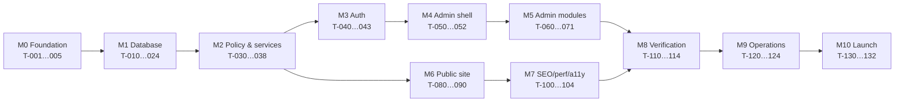

# Build Tracker — Shifa International School

**Purpose:** make `ARCHITECTURE.md` resumable. An agent should read ~10KB of state, then one task card, then one or two architecture sections — never the whole document.

**Status lives in [`build-state.json`](build-state.json), never here.** This file defines *what* each task is; the JSON records *where you are*. Keeping status in one place only means the two can never disagree.

---

## How to resume work (paste this to start any session)

```
Read build-state.json and follow its read_order_for_ai. Do exactly one task, then stop.
```

That is the whole prompt. Everything the agent needs to find its place, scope its work, verify it, and stop is reachable from that file.

### The loop

```
build-state.json ──▶ first `todo` whose `needs` are all `done`
        │
        ▼
BUILD-TRACKER.md ──▶ read ONLY that task's card
        │
        ▼
ARCHITECTURE.md  ──▶ read ONLY the sections in the card's **Load** line
        │
        ▼
   build ──▶ verify ──▶ update build-state.json ──▶ STOP
```

### Card anatomy

| Field | Meaning |
|---|---|
| **Needs** | Task ids that must be `done` first |
| **Unlocks** | What becomes available after |
| **Load** | The *only* architecture sections to open. If a card says `§B-6`, do not read `§B-5` or `§B-7`. |
| **Start** | The precondition — what must already be true |
| **Do** | The work. Nothing outside this list. |
| **Files** | The only paths this task may create or modify |
| **Contract** | What later tasks are allowed to depend on. Do not change a published contract without a new task id. |
| **Stop** | The explicit boundary — including what is deliberately *not* in scope |
| **Verify** | Must pass before the task may be marked `done` |

### Non-negotiables

1. **One task per session.** Never chain, even if the next looks trivial. Chaining is how scope drift and unreviewable diffs happen.
2. **Never edit a `done` task's output.** Add a new task id; mark the old one `superseded`.
3. **Never originate a fact about the school.** See `ARCHITECTURE.md` §A-3.1. Use `[[CONTENT REQUIRED — DO NOT PUBLISH]]`.
4. **Scope drift = stop.** If the work needs a file outside **Files**, stop and report rather than expanding.
5. **`PRODUCT-SPEC.md` assumes every decision in `ARCHITECTURE.md` Parts A/B.** If a task card's `Load` line names both, `ARCHITECTURE.md` wins on anything they disagree about.
6. One completed task = one commit, `T-0XX: <title>`.

---

## Dependency map



M5 (admin) and M6 (public) can interleave once M2 is done — they share only the service layer. M8 gates everything after it.

---
---

# M0 · Foundation

#### T-001 · Repo, Next.js, TypeScript, Tailwind
**Needs** — · **Unlocks** T-002, T-003, T-005
**Load** *(none — self-contained)*
**Start** Empty `d:/Shifa_edu` alongside the existing `.md` docs. `git init` first.
**Do** Next.js 14+ App Router, TypeScript strict, Tailwind, ESLint + Prettier, `.gitignore`, `.editorconfig`, folder skeleton `src/{app,components,lib,i18n,types}`, `README.md` pointing at the four docs and this tracker.
**Files** `package.json`, `tsconfig.json`, `next.config.js`, `tailwind.config.ts`, `.eslintrc`, `.prettierrc`, `.gitignore`, `README.md`, `src/**` (empty index files only)
**Contract** `@/` path alias → `src/`. Strict TS on.
**Stop** App boots to a blank page. **No** design tokens (T-002), **no** database (T-004), **no** pages.
**Verify** `npm run dev` serves `/`; `npm run build` and `tsc --noEmit` clean.

---

#### T-002 · Design tokens & typography
**Needs** T-001 · **Unlocks** T-050, T-080, T-102
**Load** `ARCHITECTURE.md` §A-8 · `design-system.md` §2, §3, §5, §9
**Start** T-001 builds clean.
**Do** All colour tokens as CSS custom properties on `:root`, mapped into `tailwind.config.ts` (`primary`, `ink`, `accent`, `teal`, `surface`, `surface-alt`, `border`, `success`, `danger`). Type scale with the **four-family stacks** from §A-8.2 (Playfair Display + Tiro Bangla; Source Sans 3 + Hind Siliguri). Bangla body 17px / line-height 1.75 utility. Base button, card, input, link classes per `design-system.md` §5.
**Files** `src/app/globals.css`, `tailwind.config.ts`, `src/lib/fonts.ts`
**Contract** No component may ever use a hex literal. Tokens only.
**Stop** Tokens and font stacks exist and render on a scratch page. **Do not** subset fonts yet (T-102) or build layout (T-080).
**Verify** A test page renders a Bangla and an English heading in the correct families; grep finds no `#` hex literal outside `globals.css`/`tailwind.config.ts`.

---

#### T-003 · Env config & secret handling
**Needs** T-001 · **Unlocks** T-004
**Load** `ARCHITECTURE.md` §A-12 (secrets row only)
**Start** T-001 done.
**Do** `.env.example` with every required key and no values. Zod-validated env loader that fails fast at boot with a readable message. `.env*` in `.gitignore`.
**Files** `.env.example`, `src/lib/env.ts`, `.gitignore`
**Contract** Every module reads config via `env` from `src/lib/env.ts` — never `process.env` directly.
**Stop** **No secret value in any committed file, ever.** No database connection yet.
**Verify** Boot with a missing key fails with a named error; `git ls-files | grep '^\.env$'` returns nothing.

---

#### T-004 · PostgreSQL + Prisma wiring
**Needs** T-003 · **Unlocks** T-010
**Load** `ARCHITECTURE.md` §B-18
**Start** T-003 done.
**Do** Local Postgres via `docker-compose.yml` (PG 16). Install Prisma. `prisma/schema.prisma` with datasource + generator **only, no models**. Prisma client singleton. Enable `pgcrypto` and `citext` in an initial extensions migration. Scripts: `db:migrate`, `db:reset`, `db:studio`.
**Files** `docker-compose.yml`, `prisma/schema.prisma`, `prisma/migrations/0001_extensions/migration.sql`, `src/lib/prisma.ts`, `package.json`
**Contract** `prisma` client imported only from `src/lib/prisma.ts`.
**Stop** `npm run db:migrate` succeeds on an empty database with only extensions. **No tables.**
**Verify** `SELECT gen_random_uuid()` works; `SELECT 'A'::citext = 'a'` returns true.

---

#### T-005 · CI skeleton
**Needs** T-001 · **Unlocks** T-114
**Load** `ARCHITECTURE.md` §A-14.2
**Start** T-001 done.
**Do** GitHub Actions: install → lint → typecheck → build → unit tests (empty suite OK) → secret scan (gitleaks). Vitest configured. Committed lockfile, `npm audit` step, Dependabot config.
**Files** `.github/workflows/ci.yml`, `.github/dependabot.yml`, `vitest.config.ts`
**Contract** Every later task adds its tests to this pipeline; the pipeline is never bypassed.
**Stop** Pipeline green on an empty test suite. **No** performance/a11y budgets yet (T-114).
**Verify** CI passes on a pushed branch.

---
---

# M1 · Database

> Every migration in this milestone is hand-written SQL from `ARCHITECTURE.md` Part B. Prisma models come later, in T-023, mapped *over* this SQL. Do not let Prisma generate the schema.

#### T-010 · Migration: reference & lookup tables
**Needs** T-004 · **Unlocks** T-011, T-020
**Load** `ARCHITECTURE.md` §B-1, §B-3
**Start** Extensions migration applied.
**Do** Create every table in §B-3 exactly as written: `locales`, `roles`(+tr), `modules`(+tr), `permission_actions`(+tr), `module_actions`, `special_grants`, `content_statuses`, `notice_categories`(+tr), `gallery_categories`(+tr), `calendar_event_types`(+tr), `fee_types`(+tr), `designations`(+tr), `class_stages`(+tr), `contact_channel_types`, `social_platforms`, `video_providers`, `registration_id_types`(+tr), `contact_message_statuses`. Include the two partial unique indexes on `locales`.
**Files** `prisma/migrations/0002_reference/migration.sql`
**Contract** All lookup codes are `TEXT` natural keys. **Never** convert these to Prisma enums — that reintroduces ADR-002.
**Stop** Tables exist and are empty. **No seed rows** (T-024). No other tables.
**Verify** Migration applies clean on a fresh DB; inserting a second `is_default` locale fails.

---

#### T-011 · Migration: identity, sessions, authorization
**Needs** T-010 · **Unlocks** T-012, T-021, T-031, T-032, T-033
**Load** `ARCHITECTURE.md` §A-9, §B-4
**Start** T-010 applied.
**Do** `users`, `user_module_permissions` (incl. the **composite FK to `module_actions`**), `user_special_grants`, `sessions`, `password_reset_tokens`, `login_attempts`, `rate_limit_counters`. Partial unique indexes on live username/email.
**Files** `prisma/migrations/0003_identity/migration.sql`
**Contract** Absence of a `user_module_permissions` row **is** denial. No boolean permission columns anywhere.
**Stop** Tables only. **No** auth code, **no** permission engine (T-031).
**Verify** Granting `(user, 'home', 'delete')` fails when `module_actions` has no such pair; granting a valid pair succeeds.

---

#### T-012 · Migration: media assets
**Needs** T-011 · **Unlocks** T-013, T-037
**Load** `ARCHITECTURE.md` §A-10, §B-5
**Start** T-011 applied.
**Do** `media_assets`, `media_asset_translations`, `media_variants` + the checksum and live indexes.
**Files** `prisma/migrations/0004_media/migration.sql`
**Contract** Every file reference in every later table is a `media_id` FK. **No table may ever store a bare URL string for an uploaded file.**
**Stop** Tables only. **No** upload pipeline (T-037), no storage client.
**Verify** Migration clean; `bucket` CHECK rejects a value other than `public`/`private`.

---

#### T-013 · Migration: site config & SEO
**Needs** T-012 · **Unlocks** T-014, T-017, T-018, T-019, T-060, T-080
**Load** `ARCHITECTURE.md` §A-9.4, §B-6
**Start** T-012 applied.
**Do** `site_branding`(+tr), `site_settings`(+tr), `school_registration_ids`, `contact_channels`(+tr), `social_links`, `site_stats`(+tr), `pages`, `page_translations`. Include the singleton `CHECK (id = 1)` on both singletons and `ck_stat_verified`.
**Files** `prisma/migrations/0005_site_config/migration.sql`
**Contract** Branding is a **separate table** from settings — that separation *is* the permission boundary for `edit_branding`. Do not merge them.
**Stop** Tables only.
**Verify** Inserting a second `site_settings` row fails; inserting an active `site_stats` row with `verified_on IS NULL` fails.

---

#### T-014 · Migration: academics
**Needs** T-013 · **Unlocks** T-015, T-016, T-022, T-063, T-083
**Load** `ARCHITECTURE.md` §B-8
**Start** T-013 applied.
**Do** `academic_years`(+tr), `academic_info`(+tr), `class_grades`(+tr), `class_sections`, `subjects`(+tr), `class_subjects`, `class_routines`(+`ux_routine_current`), `calendar_events`(+tr), `exam_terms`(+tr), `exams`(+tr).
**Files** `prisma/migrations/0006_academics/migration.sql`
**Contract** `class_sections` are **real rows**. Nothing anywhere may store a section *count*. Everything time-varying carries `academic_year_id`.
**Stop** Tables only.
**Verify** Two `is_current` academic years cannot coexist; two current routines for the same class/section/year cannot coexist.

---

#### T-015 · Migration: faculty
**Needs** T-014 · **Unlocks** T-022, T-065, T-085
**Load** `ARCHITECTURE.md` §A-16.2, §B-7
**Start** T-014 applied.
**Do** `faculty`, `faculty_translations`, `faculty_private`, `faculty_subjects`, `faculty_class_assignments` + the public partial index and `ck_faculty_photo_consent`.
**Files** `prisma/migrations/0007_faculty/migration.sql`
**Contract** `faculty_private` is **never** joined by any public read path. This is enforced later by a CI import test (T-113).
**Stop** Tables only.
**Verify** Setting `photo_media_id` without `photo_consent_at` fails.

---

#### T-016 · Migration: admission & fees
**Needs** T-014 · **Unlocks** T-022, T-064, T-084
**Load** `ARCHITECTURE.md` §B-9
**Start** T-014 applied.
**Do** `admission_cycles`(+tr), `admission_steps`(+tr), `admission_documents`(+tr), `admission_eligibility`(+tr), `admission_faqs`(+tr), `fee_structures`, `fee_items`.
**Files** `prisma/migrations/0008_admission/migration.sql`
**Contract** `fee_items` carries **only** `amount`. Recurrence and ordering live on `fee_types` — see §B-1.4. Do not add them back.
**Stop** Tables only.
**Verify** Duplicate `(fee_structure_id, fee_type_id)` rejected; one fee structure per class per year enforced.

---

#### T-017 · Migration: home & about content
**Needs** T-013 · **Unlocks** T-022, T-061, T-062, T-081, T-082
**Load** `ARCHITECTURE.md` §B-10
**Start** T-013 applied.
**Do** `hero_slides`(+tr), `home_content`(+tr), `features`(+tr), `about_content`(+tr), `committee_members`(+tr), `achievements`(+tr).
**Files** `prisma/migrations/0009_home_about/migration.sql`
**Contract** Both singletons enforce `CHECK (id = 1)`.
**Stop** Tables only.
**Verify** Migration clean; singleton guards hold.

---

#### T-018 · Migration: notices
**Needs** T-013 · **Unlocks** T-022, T-066, T-086
**Load** `ARCHITECTURE.md` §B-11
**Start** T-013 applied.
**Do** `notices` (+`ck_notice_published`, public partial index), `notice_translations` (per-locale unique slug), `notice_attachments`(+tr).
**Files** `prisma/migrations/0010_notices/migration.sql`
**Contract** Public visibility is `status='published' AND published_at <= now() AND deleted_at IS NULL` — that expression is the definition, used identically everywhere.
**Stop** Tables only.
**Verify** `status='published'` with `published_at IS NULL` is rejected; duplicate `(locale, slug)` rejected.

---

#### T-019 · Migration: gallery
**Needs** T-013 · **Unlocks** T-022, T-067, T-087
**Load** `ARCHITECTURE.md` §B-12
**Start** T-013 applied.
**Do** `gallery_albums`(+tr), `gallery_photos`(+tr), `gallery_videos`(+tr).
**Files** `prisma/migrations/0011_gallery/migration.sql`
**Contract** Category lives on the **album only** — never duplicated onto a photo. Embed URLs are **never stored** — they derive from `video_providers.embed_url_template`.
**Stop** Tables only.
**Verify** `gallery_photos` has no category column; `gallery_videos` has no url column; duplicate `(provider, video_id)` rejected.

---

#### T-020 · Migration: contact messages
**Needs** T-010 · **Unlocks** T-022, T-068, T-088, T-121
**Load** `ARCHITECTURE.md` §A-16.1, §B-13
**Start** T-010 applied.
**Do** `contact_messages` including the **`GENERATED ALWAYS … STORED`** `purge_after` column and both indexes.
**Files** `prisma/migrations/0012_contact/migration.sql`
**Contract** `purge_after` is database-generated. Never written by application code.
**Stop** Table only. **No** purge job (T-121), no form.
**Verify** Inserting a row auto-populates `purge_after` at +12 months; an attempt to write it directly fails.

---

#### T-021 · Migration: audit log
**Needs** T-011 · **Unlocks** T-022, T-035
**Load** `ARCHITECTURE.md` §B-14, §B-16 (Exception 1)
**Start** T-011 applied.
**Do** `activity_logs` with `actor_user_id ON DELETE SET NULL`, the actor snapshot columns, three indexes, and `REVOKE UPDATE, DELETE ON activity_logs FROM PUBLIC`.
**Files** `prisma/migrations/0013_audit/migration.sql`
**Contract** Append-only. Snapshot columns are historical fact, never refreshed.
**Stop** Table only. **No** audit writer (T-035).
**Verify** Deleting a user leaves the log rows with `actor_user_id` NULL and the snapshot intact; `UPDATE activity_logs` is refused.

---

#### T-022 · Migration: indexes & partial indexes
**Needs** T-015, T-016, T-017, T-018, T-019, T-020, T-021 · **Unlocks** T-023
**Load** `ARCHITECTURE.md` §B-17
**Start** All content migrations applied.
**Do** Every index in §B-17 not already created inline, including the GIN full-text index on `notice_translations`.
**Files** `prisma/migrations/0014_indexes/migration.sql`
**Contract** Public read indexes are **partial** — they exclude deleted and unpublished rows.
**Stop** Indexes only. No query code.
**Verify** `EXPLAIN` on the notice-list query uses `ix_notices_public`.

---

#### T-023 · Prisma schema mapping
**Needs** T-022 · **Unlocks** T-024, T-030, T-031, T-032, T-033, T-034, T-036
**Load** `ARCHITECTURE.md` §B-18
**Start** All migrations applied.
**Do** Write `schema.prisma` models mapping onto the existing SQL with `@@map`/`@map`. Composite `@@id` on every translation model. Use `prisma db pull` as a starting point, then hand-correct naming and relations. Generate the client. Verify with `prisma migrate diff` that the schema and database agree.
**Files** `prisma/schema.prisma`, `src/types/db.ts`
**Contract** Prisma never owns the schema — SQL migrations do. Lookup tables stay relations, never enums.
**Stop** Client generates and typechecks. **No** repositories or queries yet.
**Verify** `prisma migrate diff --from-schema-datamodel --to-schema-datasource` reports no drift; `tsc --noEmit` clean.

---

#### T-024 · Idempotent seed script
**Needs** T-023 · **Unlocks** T-040, T-111
**Load** `ARCHITECTURE.md` §B-19
**Start** T-023 done.
**Do** Seed in the §B-19 order, every insert `ON CONFLICT DO NOTHING` on a natural key. Super Admin password **generated at runtime**, printed once, `must_change_password = true`.
**Files** `prisma/seed.ts`, `package.json`
**Contract** Seed is safe to run any number of times.
**Stop** **Do not seed**: `site_stats` values, sample teachers, sample notices, sample photos, committee members, achievements, fee amounts, principal's message, history, vision, mission, or an open admission banner. §B-19 lists these explicitly.
**Verify** Running seed twice yields 14 class grades, not 28; no password literal appears in any file; `grep -ri "95%" prisma/` finds nothing.

---
---

# M2 · Policy & core services

> This milestone builds the layer every feature depends on. Nothing here renders UI.

#### T-030 · i18n runtime
**Needs** T-023 · **Unlocks** T-040, T-050, T-080
**Load** `ARCHITECTURE.md` §A-7
**Start** T-023 done.
**Do** Locale resolution from URL prefix (`''`→bn, `en`→en). `bn.json`/`en.json` with namespaces `common`, `public`, `admin`, `errors`. `t()` helper, `useLocale`, locale-aware `Link`. Fallback helper returning `{ value, isFallback, lang }` per §A-7.3.
**Files** `src/i18n/{bn,en}.json`, `src/lib/i18n.ts`, `src/lib/locale.ts`, `src/hooks/useLocale.ts`
**Contract** Locale is **never** read from a cookie for content resolution — only from the URL. Fallback marks `isFallback` so callers can emit `lang="bn"`.
**Stop** Helpers + JSON files. **No** language switcher UI (T-080), no routing changes to pages that do not exist yet.
**Verify** Unit tests: prefix→locale mapping both ways; fallback returns Bangla with `isFallback: true` when English is missing; key parity between the two JSON files.

---

#### T-031 · Permission engine
**Needs** T-023 · **Unlocks** T-035, T-038, T-050
**Load** `ARCHITECTURE.md` §A-9.3, §A-9.4, §A-5.2
**Start** T-023 done.
**Do** `loadPermissions(userId)` — one query, request-memoized, returning a `Set<"module:action">` plus the special-grant set. `can(user, module, action)` with the `super_admin` bypass and the `isActive` check. `assertCan()` that throws a typed 403. Module registry from §A-5.2.
**Files** `src/lib/permissions.ts`, `src/lib/modules.ts`
**Contract** **Fails closed.** No row = denied. `can()` is the only authorization decision point in the codebase.
**Stop** Server-side logic only. **No** `PermissionGate` component (T-051), no UI.
**Verify** Unit tests: absent row → false; suspended user → false for everything; super admin → true for everything; `edit_branding` is checked separately from `site_settings:edit`.

---

#### T-032 · Session service
**Needs** T-023 · **Unlocks** T-040, T-041
**Load** `ARCHITECTURE.md` §A-9.2
**Start** T-023 done.
**Do** Issue (random token, store SHA-256 only), verify (not expired, `revoked_at IS NULL`, touch `last_seen_at`), revoke-one, `revokeAllForUser(userId, reason)`. Cookie helpers: HTTP-only, Secure, SameSite=Lax. 8h idle / 24h absolute.
**Files** `src/lib/session.ts`, `src/lib/cookies.ts`
**Contract** The raw token never touches the database. `revokeAllForUser` is called on suspend, delete, password change and role change — every one of those code paths must call it.
**Stop** Service only. **No** login page (T-040), no middleware (T-041).
**Verify** Integration tests: revoked session fails verification; expired fails; `revokeAllForUser` invalidates every live session for that user.

---

#### T-033 · Durable rate limiting
**Needs** T-023 · **Unlocks** T-040, T-088
**Load** `ARCHITECTURE.md` §A-9.2 (brute force row), §A-12 (rate limiting row)
**Start** T-023 done.
**Do** `consume(bucketKey, limit, windowSeconds)` backed by `rate_limit_counters` in a single atomic upsert. `recordLoginAttempt()` writing `login_attempts`. Buckets: login 5/15min keyed on **both** username and IP; contact 3/hour per IP; upload 20/hour per user.
**Files** `src/lib/rate-limit.ts`
**Contract** State is in the database, never in module scope — serverless invocations do not share memory (ADR-014).
**Stop** Service only. No callers yet.
**Verify** Integration test: 6th call inside the window is refused; a fresh window resets; concurrent calls do not over-admit.

---

#### T-034 · Validation & sanitization
**Needs** T-023 · **Unlocks** T-037, T-038
**Load** `ARCHITECTURE.md` §A-5.1, §A-12 (XSS row)
**Start** T-023 done.
**Do** Zod schemas per module input, `.strict()` so unknown keys are rejected. `sanitizeHtml()` with an explicit tag/attribute allowlist. Shared validators: BD phone `01XXXXXXXXX`, email, URL, hex colour, slug.
**Files** `src/lib/validation/*.ts`, `src/lib/sanitize.ts`
**Contract** Rich text is sanitized **on write**; render-side sanitization is added in T-080 as the second layer. Both, always.
**Stop** Schemas + sanitizer. No endpoints.
**Verify** XSS payload suite (`<script>`, `onerror=`, `javascript:` href, SVG payload) all neutralized; unknown key rejected with 422.

---

#### T-035 · Audit writer
**Needs** T-031, T-021 · **Unlocks** T-038
**Load** `ARCHITECTURE.md` §B-14, §A-5.1 (stage 5)
**Start** T-031 and T-021 done.
**Do** `writeAudit(tx, {actor, action, module, entityTable, entityId, summary, diff, ip})` accepting a Prisma transaction client. Snapshot `username`/`role` from the actor at write time. Diff builder producing `{field:{from,to}}`.
**Files** `src/lib/audit.ts`
**Contract** Takes a transaction handle — **the audit row commits with the mutation or not at all.**
**Stop** Writer only.
**Verify** Integration test: a rolled-back mutation leaves no audit row; a committed one always writes exactly one.

---

#### T-036 · Cache tags & revalidation
**Needs** T-023 · **Unlocks** T-038, T-080, T-103
**Load** `ARCHITECTURE.md` §A-6
**Start** T-023 done.
**Do** Tag constants from the §A-6 table. `revalidateForModule(moduleCode)` mapping module → tags + paths, **covering both locales**. Typed cached-read wrapper.
**Files** `src/lib/cache.ts`
**Contract** Every module's tag set is declared once, here. Adding a module means adding a row here.
**Stop** Registry + helpers. Wiring into ISR is T-103.
**Verify** Unit test: every module code in `src/lib/modules.ts` has a tag mapping; `site_settings` maps to all paths.

---

#### T-037 · Media upload pipeline
**Needs** T-034, T-012 · **Unlocks** T-061…T-067, T-071
**Load** `ARCHITECTURE.md` §A-10
**Start** T-034 and T-012 done.
**Do** Storage client with `public`/`private` buckets. Upload: size cap by type → **MIME sniff from file bytes** → EXIF strip → randomized key → image resize ≤1920 + 400/800 variants → AVIF/WebP → checksum dedupe → `media_assets` + `media_variants` insert. Signed-URL helper (15 min) for private objects.
**Files** `src/lib/storage.ts`, `src/lib/upload.ts`, `src/app/api/upload/route.ts`
**Contract** Default bucket is `private`; `public` is an explicit argument. Original filenames are never used as storage keys.
**Stop** Pipeline + endpoint. **No** admin media UI (T-071).
**Verify** A `.exe` renamed `.jpg` is rejected on byte inspection; oversize rejected; duplicate upload reuses the existing asset; a private object 403s without a signature.

---

#### T-038 · Write-pipeline helper
**Needs** T-031, T-034, T-035, T-036 · **Unlocks** all of M5
**Load** `ARCHITECTURE.md` §A-5.1
**Start** T-031, T-034, T-035, T-036 done.
**Do** A single `mutate({ module, action, schema, handler })` wrapper executing the six mandatory stages in order: authenticate → authorize → validate → sanitize → persist+audit in one transaction → invalidate.
**Files** `src/lib/mutate.ts`
**Contract** **Every** admin mutation in M5 goes through this wrapper. A Server Action that writes without it is a defect, and T-110 will catch it.
**Stop** Wrapper only.
**Verify** Unit tests prove each stage runs and that failure at any stage prevents all later stages; an unauthorized call writes no data and no audit row.

---
---

# M3 · Authentication

#### T-040 · Login page & credential flow
**Needs** T-032, T-033, T-030 · **Unlocks** T-041, T-042, T-043, T-050
**Load** `ARCHITECTURE.md` §A-9.2
**Start** M2 auth services done, seed run.
**Do** `/login` (+`/en/login`): username-or-email + password, bilingual. Verify bcrypt (cost 12), rate-limit check before verification, `login_attempts` record, lockout honoured, session issue, redirect by resolved role.
**Files** `src/app/(public)/login/page.tsx`, `src/app/api/auth/login/route.ts`, `src/lib/auth.ts`
**Contract** **No role selector** (ADR / AUDIT S-8). Role comes from credentials. Error messages never reveal whether a username exists.
**Stop** Login + logout. **No** password reset (T-042), **no** forced change (T-043), no admin layout (T-050).
**Verify** 6th failed attempt is locked out; suspended user cannot log in; timing and message identical for unknown-user and wrong-password.

---

#### T-041 · Route middleware & admin guard
**Needs** T-032 · **Unlocks** T-050
**Load** `ARCHITECTURE.md` §A-6, §A-9.2
**Start** T-040 done.
**Do** Middleware: resolve locale prefix for public routes; for `/admin/*` verify session, check `revoked_at`, redirect to `/login?next=` when absent. `no-store` on all admin responses.
**Files** `src/middleware.ts`
**Contract** Middleware is a convenience redirect, **not** an authorization boundary. Every action still calls `assertCan()`.
**Stop** Middleware only.
**Verify** Unauthenticated `/admin` redirects; a revoked session is rejected mid-session on the next request.

---

#### T-042 · Password reset
**Needs** T-040 · **Unlocks** —
**Load** `ARCHITECTURE.md` §A-9.2 (reset row)
**Start** T-040 done.
**Do** Request form → single-use token (hashed, 30 min) → email → reset form → set password, `revokeAllForUser('password_change')`, invalidate the token. Transactional email provider behind an interface.
**Files** `src/app/(public)/reset-password/**`, `src/app/api/auth/reset/**`, `src/lib/mail.ts`
**Contract** The request response is identical whether or not the email exists.
**Stop** Reset flow only.
**Verify** Token single-use; expired rejected; reset revokes all existing sessions.

---

#### T-043 · Forced first-login password change
**Needs** T-040 · **Unlocks** —
**Load** `ARCHITECTURE.md` §A-9.2 (first login row)
**Start** T-040 done.
**Do** When `must_change_password`, every admin route redirects to `/admin/change-password` until it is cleared. Enforce a minimum strength policy.
**Files** `src/app/admin/change-password/page.tsx`, `src/middleware.ts`
**Contract** No admin action is reachable while the flag is set.
**Stop** This flow only.
**Verify** A freshly seeded super admin cannot reach `/admin` before changing the password.

---
---

# M4 · Admin shell

#### T-050 · Admin layout & permission-filtered sidebar
**Needs** T-041, T-031, T-030 · **Unlocks** T-051
**Load** `ARCHITECTURE.md` §A-5.2, §A-9.3 · `PRODUCT-SPEC.md` §P-7.1 (layout sketch only)
**Start** T-041 done.
**Do** Admin shell: header (user, role, locale toggle, logout), sidebar rendered from the module registry filtered by `view` permission, mobile drawer, breadcrumbs. **Bilingual** via the `admin` i18n namespace (ADR-007).
**Files** `src/app/admin/layout.tsx`, `src/components/admin/{AdminHeader,AdminSidebar}.tsx`
**Contract** The sidebar renders a link only when the user holds `module:view`. `users` shows only for `super_admin`.
**Stop** Shell only — every module page is a stub.
**Verify** An admin with only `notice:view` sees exactly one module link.

---

#### T-051 · Shared admin UI kit
**Needs** T-050 · **Unlocks** all of M5
**Load** `ARCHITECTURE.md` §A-7.3, §A-9.3 · `design-system.md` §5
**Start** T-050 done.
**Do** `PermissionGate`, `DataTable` (server-side pagination + search + sort), `DualLocaleField` (BN required / EN optional with the "EN missing" badge), `RichTextEditor`, `ImagePicker`, `SortableList`, `ConfirmDialog` (names the child records at risk), `Toast`, `FormShell`.
**Files** `src/components/admin/**`, `src/components/ui/**`
**Contract** `PermissionGate` is **presentation only**. Removing it must change nothing the server permits. `DataTable` paginates server-side from day one.
**Stop** Components + a storybook-style demo page. No module wiring.
**Verify** `DualLocaleField` blocks save on empty Bangla, allows it on empty English with the badge shown.

---

#### T-052 · Admin dashboard
**Needs** T-051 · **Unlocks** —
**Load** `ARCHITECTURE.md` §A-15 (freshness row) · `PRODUCT-SPEC.md` §P-7.2
**Start** T-051 done.
**Do** Stat cards (teachers, published notices, unread messages, gallery items), last 10 `activity_logs` entries, quick actions **filtered by permission**, and a content-freshness panel (stale notices, unread messages > 7 days, sections still holding placeholders).
**Files** `src/app/admin/page.tsx`, `src/components/admin/Dashboard*.tsx`
**Contract** Every widget respects `view` permission — an admin without `contact:view` sees no message count.
**Stop** Dashboard only.
**Verify** A limited admin sees only permitted widgets and quick actions.

---
---

# M5 · Admin modules

> Every task here uses `mutate()` from T-038. Every one is independently shippable. Pattern per module: read model → list/edit UI → Server Actions → permission checks → audit → revalidate.

#### T-060 · Admin: Site Settings + protected branding
**Needs** T-051, T-038 · **Unlocks** —
**Load** `ARCHITECTURE.md` §A-9.4, §B-6
**Start** T-038, T-051 done.
**Do** Two visually separated panels. **Branding** (name BN/EN, logo, reversed logo, favicon, OG image) gated on `super_admin OR edit_branding`. **Settings** (address, office hours, slogan, phones, socials, registration ids, statistics with `verified_on`, map) gated on `site_settings:edit`.
**Files** `src/app/admin/site-settings/**`, `src/lib/modules/site-settings/**`
**Contract** A statistic cannot be activated without `verified_on`. The two panels are separate Server Actions with separate checks.
**Stop** This module only.
**Verify** An admin with `site_settings:edit` but no `edit_branding` gets 403 on a school-name change and 200 on an address change.

---

#### T-061 · Admin: Home content
**Needs** T-051, T-038, T-037 · **Load** `ARCHITECTURE.md` §B-10
**Do** Hero slides (upload, reorder, schedule, activate) · intro text (dual locale) · CTA block · features CRUD.
**Files** `src/app/admin/home/**`, `src/lib/modules/home/**`
**Contract** Every uploaded image requires alt text in Bangla before save.
**Stop** Home module only. **Verify** Reorder persists; save revalidates `/` and `/en`; audit row written.

---

#### T-062 · Admin: About content
**Needs** T-051, T-038, T-037 · **Load** `ARCHITECTURE.md` §B-10
**Do** History / vision / mission / principal's message (dual rich text) · principal photo + signature · committee CRUD (with `publish_consent_at`) · achievements CRUD.
**Files** `src/app/admin/about/**`, `src/lib/modules/about/**`
**Contract** A committee member without consent cannot be activated.
**Stop** About module only. **Verify** Rich text is sanitized on save; consent gate enforced.

---

#### T-063 · Admin: Academics
**Needs** T-051, T-038, T-037 · **Load** `ARCHITECTURE.md` §B-8
**Do** Academic years · general info · class grades CRUD · **sections CRUD** · subject master CRUD · class↔subject assignment · routine upload (one current per class/section/year) · calendar events · exam terms and exams.
**Files** `src/app/admin/academics/**`, `src/lib/modules/academics/**`
**Contract** Deleting a class grade with dependent fee structures or exams is **refused with an explanation** (`RESTRICT`), never cascaded.
**Stop** Academics module only. **Verify** The refusal message names the blocking records; uploading a new routine demotes the previous `is_current`.

---

#### T-064 · Admin: Admission & fees
**Needs** T-051, T-038, T-037 · **Load** `ARCHITECTURE.md` §B-9
**Do** Admission cycle (open/closed, dates, banner) · steps CRUD · documents CRUD · eligibility per class · FAQs CRUD · form PDF · **fee grid** (class × fee type, add any fee type).
**Files** `src/app/admin/admission/**`, `src/lib/modules/admission/**`
**Contract** Fee amounts are `NUMERIC`. New charge types are added by creating a `fee_type`, never a schema change.
**Stop** Admission module only. **Verify** Adding a "Transport" fee type appears in the grid without a migration.

---

#### T-065 · Admin: Faculty
**Needs** T-051, T-038, T-037 · **Load** `ARCHITECTURE.md` §A-16.2, §B-7
**Do** Faculty CRUD: public fields (dual locale), designation, subjects (multi), photo, sort, status. Separate clearly-labelled **Internal** panel writing `faculty_private`. Consent checkboxes stamping `publish_consent_at` / `photo_consent_at`. Auto `employee_code` (`SIS-F-001`).
**Files** `src/app/admin/faculty/**`, `src/lib/modules/faculty/**`
**Contract** The internal panel is visible only to `super_admin`. Publishing without consent is impossible. **Do not generate a faculty password here** — credentials are created at Phase 2 enable-time, not years in advance.
**Stop** Faculty module only. **Verify** Publish blocked without consent; the internal panel 403s for a non-super-admin.

---

#### T-066 · Admin: Notices
**Needs** T-051, T-038, T-037 · **Load** `ARCHITECTURE.md` §B-11
**Do** Notice CRUD with dual-locale title/excerpt/body, per-locale slug auto-generation, category, **multiple attachments**, pin, scheduled `published_at`, and a **separate `publish` action** distinct from `edit`.
**Files** `src/app/admin/notices/**`, `src/lib/modules/notices/**`
**Contract** `notice:publish` is checked independently — an admin with `add`+`edit` but not `publish` can only save drafts.
**Stop** Notices module only. **Verify** An admin without `publish` gets 403 attempting to publish but 200 saving a draft.

---

#### T-067 · Admin: Gallery
**Needs** T-051, T-038, T-037 · **Load** `ARCHITECTURE.md` §B-12
**Do** Albums CRUD (category, cover, event date) · multi-photo upload into an album with per-photo caption, alt text and `subject_consent_at` · videos by provider + video id.
**Files** `src/app/admin/gallery/**`, `src/lib/modules/gallery/**`
**Contract** A photo always belongs to an album. Video embed URLs are derived, never stored.
**Stop** Gallery module only. **Verify** Pasting a full YouTube URL extracts the id and stores only that.

---

#### T-068 · Admin: Contact messages
**Needs** T-051, T-038 · **Load** `ARCHITECTURE.md` §A-16.1, §B-13
**Do** Paginated searchable inbox, detail view, mark read (records `read_by_user_id`), status change, soft delete. Show each message's `purge_after` date.
**Files** `src/app/admin/messages/**`, `src/lib/modules/messages/**`
**Contract** Read-only plus delete. No reply feature in Phase 1.
**Stop** Inbox only. **Verify** Reading stamps reader and time; delete is soft and reversible.

---

#### T-069 · Admin: Manage Admins & permission matrix
**Needs** T-051, T-038 · **Unlocks** T-110 · **Load** `ARCHITECTURE.md` §A-9.3, §A-9.4, §A-5.2, §B-4
**Do** Super-Admin-only page: list, create (generated password, `must_change_password`), suspend (→ revoke sessions), soft delete (→ revoke sessions). **Permission matrix** rendered from `module_actions`, so inapplicable cells render `—` from data, not from hardcoding. Special grants panel for `edit_branding`.
**Files** `src/app/admin/users/**`, `src/lib/modules/users/**`
**Contract** Only `super_admin` reaches any of this. Every grant change writes an audit row naming the module, action and target user.
**Stop** This module only.
**Verify** A non-super-admin gets 403 on every route and action here; suspending immediately invalidates that user's live sessions; the matrix shows `—` where `module_actions` has no row.

---

#### T-070 · Admin: My Profile
**Needs** T-051, T-038 · **Load** `ARCHITECTURE.md` §A-9.2
**Do** View own name, username, role, last login. Change own password (revokes other sessions). Read-only view of own permissions. Preferred locale.
**Files** `src/app/admin/profile/**`
**Contract** A user may never alter their own role or permissions here.
**Stop** Profile only. **Verify** Password change keeps the current session and revokes the others.

---

#### T-071 · Admin: Media library
**Needs** T-051, T-037 · **Load** `ARCHITECTURE.md` §A-10, §B-5
**Do** Browse/search assets, edit alt text and caption per locale, show **where each asset is used**, soft delete (blocked while referenced), storage usage summary.
**Files** `src/app/admin/media/**`, `src/lib/modules/media/**`
**Contract** Deletion of a referenced asset is refused and names the referencing records.
**Stop** Library only. **Verify** Usage list is accurate; deleting an in-use asset is refused.

---
---

# M6 · Public site

#### T-080 · Public layout, header, footer, language switcher
**Needs** T-030, T-036 · **Unlocks** T-081…T-090
**Load** `ARCHITECTURE.md` §A-7.1, §A-8 · `design-system.md` §5
**Start** T-030 and T-036 done.
**Do** Locale-segment route group (`/` = bn, `/en` = en). Sticky header with gold bottom rule, nav, **path-rewriting** language switcher, login link. Four-column footer. Mobile drawer. Render-side HTML sanitization layer.
**Files** `src/app/(public)/[[...locale]]/layout.tsx`, `src/components/public/{Header,Footer,LanguageSwitcher,MobileNav}.tsx`
**Contract** The switcher **rewrites the path** — it never sets a cookie to change content. Components are built to Bangla string lengths first (§A-8.3).
**Stop** Layout only — pages are stubs.
**Verify** `/notices` renders Bangla, `/en/notices` English; the switcher preserves the current path; no horizontal overflow at 360px with Bangla nav labels.

---

#### T-081 · Public: Home
**Needs** T-080 · **Load** `ARCHITECTURE.md` §B-10, §B-17 (homepage row) · `PRODUCT-SPEC.md` §P-6.2
**Do** Hero slider · school at a glance · **stats bar (renders only verified stats)** · latest 5 notices · features · gallery preview (6) · CTA banner.
**Files** `src/app/(public)/[[...locale]]/page.tsx`, `src/components/public/{HeroSlider,StatsBar,FeatureGrid}.tsx`
**Contract** Any section whose content is empty or placeholder-marked **does not render**. No empty shells.
**Stop** Home only. **Verify** With no verified stats seeded, the stats bar is absent — not showing zeros.

---

#### T-082 · Public: About
**Needs** T-080 · **Load** `ARCHITECTURE.md` §B-10, §B-6 · `PRODUCT-SPEC.md` §P-6.3
**Do** History · vision · mission · principal's message · registration ids · committee (consented only) · achievements · curriculum highlights.
**Files** `src/app/(public)/[[...locale]]/about/page.tsx`
**Contract** Committee members without consent are omitted silently.
**Stop** About only. **Verify** Placeholder-marked sections are absent; sanitized rich text renders correctly.

---

#### T-083 · Public: Academics + sub-pages
**Needs** T-080 · **Load** `ARCHITECTURE.md` §B-8 · `PRODUCT-SPEC.md` §P-6.4
**Do** `/academics` (class structure by stage, curriculum, subjects accordion, timing, assessment) plus `/academics/routines`, `/academics/calendar`, `/academics/exams`. All four in both locales.
**Files** `src/app/(public)/[[...locale]]/academics/**`
**Contract** Everything scoped to the **current** academic year, with the year shown so parents know what they are reading.
**Stop** These four pages. **Verify** Routine PDFs download; exam schedule filters by class.

---

#### T-084 · Public: Admission
**Needs** T-080 · **Load** `ARCHITECTURE.md` §B-9 · `PRODUCT-SPEC.md` §P-6.5
**Do** Status banner (open/closed styling) · process stepper · eligibility table · important dates · required documents · **fee table with ৳** · form download · FAQ accordion.
**Files** `src/app/(public)/[[...locale]]/admission/page.tsx`
**Contract** The banner shows "open" **only** when `admission_cycles.is_open` is true and within dates. Never a hardcoded string.
**Stop** Admission only. **Verify** With no cycle seeded, no open-admissions claim appears anywhere.

---

#### T-085 · Public: Faculty
**Needs** T-080 · **Load** `ARCHITECTURE.md` §B-7, §A-16.2 · `PRODUCT-SPEC.md` §P-6.6
**Do** Card grid of published, consented faculty: photo (or initials placeholder), name, designation, subjects, qualification, optional experience and bio.
**Files** `src/app/(public)/[[...locale]]/faculty/page.tsx`, `src/components/public/FacultyCard.tsx`
**Contract** The query **must not** touch `faculty_private`. T-113 enforces this in CI.
**Stop** Faculty only. **Verify** Response payload inspected for `personal_phone`/`personal_email` — must be absent.

---

#### T-086 · Public: Notices list + detail
**Needs** T-080 · **Load** `ARCHITECTURE.md` §B-11, §B-17 · `PRODUCT-SPEC.md` §P-6.7
**Do** `/notices` paginated (10/page), category filter via query param, pinned first. `/notices/[slug]` with body, category, date, multiple attachment downloads, WhatsApp/Facebook share, back link.
**Files** `src/app/(public)/[[...locale]]/notices/**`
**Contract** Visibility is exactly `status='published' AND published_at <= now() AND deleted_at IS NULL`. A future-dated notice must not appear.
**Stop** These two pages. **Verify** A scheduled notice is invisible before its time; per-locale slugs resolve.

---

#### T-087 · Public: Gallery
**Needs** T-080 · **Load** `ARCHITECTURE.md` §B-12 · ADR-006
**Do** Single `/gallery` route with `?type=photos|videos` and `?category=` — **no `/gallery/photos` or `/gallery/videos` routes** (ADR-006). Grid, lightbox with keyboard navigation, lazy loading, video modal from the provider template.
**Files** `src/app/(public)/[[...locale]]/gallery/page.tsx`, `src/components/public/{GalleryGrid,Lightbox,VideoModal}.tsx`
**Contract** Filter state lives in the URL so a filtered view is shareable.
**Stop** Gallery only. **Verify** Those two legacy routes do not exist; lightbox is keyboard-navigable and Escape-closable.

---

#### T-088 · Public: Contact + inquiry form
**Needs** T-080, T-033 · **Load** `ARCHITECTURE.md` §A-16.2, §B-13 · `PRODUCT-SPEC.md` §P-6.9
**Do** Contact cards from `contact_channels`, office hours, map embed, and the inquiry form (name, phone, email optional, message) with validation, rate limiting, **explicit consent text beside submit**, hashed IP, success toast.
**Files** `src/app/(public)/[[...locale]]/contact/page.tsx`, `src/app/api/contact/route.ts`
**Contract** The consent line states what is collected, why, and the 12-month retention, and links to the privacy policy.
**Stop** Contact only. **Verify** 4th submission in an hour is refused; raw IP is not stored; BD phone format enforced.

---

#### T-089 · Public: Privacy policy, terms, cookie notice
**Needs** T-080 · **Load** `ARCHITECTURE.md` §A-16
**Do** `/privacy` and `/terms` in both locales, content from the §A-16.1 data inventory. Cookie notice for the language-preference cookie. Footer links.
**Files** `src/app/(public)/[[...locale]]/{privacy,terms}/page.tsx`, `src/components/public/CookieNotice.tsx`
**Contract** Drafted by AI, **flagged for human/legal review** before launch — this is a T-131 gate, not a T-089 one.
**Stop** These pages. **Verify** Both reachable in both locales and linked from the footer.

---

#### T-090 · Public: 404, error, empty & maintenance states
**Needs** T-080 · **Load** `ARCHITECTURE.md` §A-13.4 (empty states)
**Do** Bilingual `not-found.tsx`, `error.tsx`, loading skeletons, a reusable empty-state component ("No notices yet"), and a maintenance-mode flag.
**Files** `src/app/(public)/[[...locale]]/{not-found,error,loading}.tsx`, `src/components/public/EmptyState.tsx`
**Contract** No page ever renders a bare blank region. Empty is a designed state.
**Stop** These states. **Verify** A bad URL shows the bilingual 404 with working navigation.

---
---

# M7 · SEO, performance, accessibility

#### T-100 · SEO
**Needs** all M6 page tasks · **Unlocks** T-103
**Load** `ARCHITECTURE.md` §A-7.1, §B-6 (pages/page_translations) · `PRODUCT-SPEC.md` §P-9
**Do** Per-page metadata from `page_translations`, `hreflang` alternates **to distinct URLs** plus `x-default`, canonical, Open Graph, JSON-LD `EducationalOrganization`, `sitemap.xml` (both locales, English entries only where translated), `robots.txt` disallowing `/admin`.
**Files** `src/app/sitemap.ts`, `src/app/robots.ts`, `src/lib/seo.ts`, metadata exports per page
**Contract** `hreflang` never points two locales at one URL — that was the defect in AUDIT B-3.
**Stop** SEO only. **Verify** `/` and `/en` emit different canonicals and correct reciprocal alternates; sitemap excludes untranslated English pages.

---

#### T-101 · Responsive image delivery
**Needs** T-087 · **Load** `ARCHITECTURE.md` §A-10.3, §A-11
**Do** Image component consuming `media_variants` for `srcset`, explicit width/height from `media_assets` (prevents CLS), AVIF→WebP→JPEG, blur placeholder, lazy below the fold.
**Files** `src/components/ui/Image.tsx`, `next.config.js`
**Contract** Every public image goes through this component. No bare ``.
**Stop** Delivery only. **Verify** Gallery page transfers under budget; CLS ≤ 0.1.

---

#### T-102 · Font subsetting & loading
**Needs** T-002, T-080 · **Load** `ARCHITECTURE.md` §A-8.2, §A-11
**Do** Self-host all four families, subset Bangla to the actual glyph range, `font-display: swap`, preload the body weight only, verify the ≤200KB total budget.
**Files** `public/fonts/**`, `src/lib/fonts.ts`, `src/app/globals.css`
**Contract** Total font payload ≤ 200KB. Unsubsetted Bangla families alone exceed this.
**Stop** Fonts only. **Verify** Measured payload under budget; no FOIT; Bangla conjuncts render correctly.

---

#### T-103 · ISR wiring & on-demand revalidation
**Needs** T-036, T-100 · **Load** `ARCHITECTURE.md` §A-6, §A-11
**Do** Static generation per locale for all public routes, cache tags attached to reads, admin saves calling `revalidateForModule`, admin routes forced dynamic.
**Files** page-level `revalidate`/`generateStaticParams`, `src/lib/cache.ts`
**Contract** Steady state = **0 DB queries** on a public cache hit.
**Stop** Caching only. **Verify** Publishing a notice updates `/` and `/en` within one request; a query-count assertion proves 0 on a cache hit.

---

#### T-104 · Accessibility remediation
**Needs** T-100 · **Load** `ARCHITECTURE.md` §A-2 (Effective, a11y row), §A-8.2 · `design-system.md` §9
**Do** Run `axe-core` over every public and admin page in **both** locales. Fix to WCAG 2.2 AA: focus order, visible focus rings, landmarks, alt text, form labels, contrast (gold on white is large-text/icon only), keyboard traps, `lang` attributes on fallback text.
**Files** across components as needed
**Contract** Zero critical or serious violations, in both locales.
**Stop** Remediation only — the CI gate is T-114.
**Verify** `axe` clean on all routes; keyboard-only walkthrough of the contact form and the notice list succeeds.

---
---

# M8 · Verification

> **Phase gate: no M9 or M10 task may start until every task here is `done`.**

#### T-110 · Authorization matrix suite
**Needs** T-069 · **Load** `ARCHITECTURE.md` §A-13.2
**Do** Build the full matrix from §A-13.2 — every case, for every mutating endpoint. Plus a **static import test** asserting no public route imports an admin or private repository, and a test asserting every Server Action goes through `mutate()`.
**Files** `tests/authorization/**`
**Contract** This suite blocks CI. It is never skipped or marked `.todo`.
**Stop** Tests only — fix defects it finds under new task ids.
**Verify** ~40 cases pass; deliberately removing one permission check makes the suite fail.

---

#### T-111 · Repository & constraint integration tests
**Needs** T-024 · **Load** `ARCHITECTURE.md` §B-15, §B-16
**Do** Real-Postgres tests for: singleton guards, `ck_stat_verified`, consent checks, `RESTRICT` refusals, soft delete + restore, `purge_after` generation, audit append-only, seed idempotency, locale fallback queries, one-current-routine.
**Files** `tests/db/**`
**Stop** Tests only. **Verify** Every constraint documented in Part B has a test that proves it fires.

---

#### T-112 · E2E golden paths
**Needs** T-088, T-066 · **Load** `ARCHITECTURE.md` §A-13.1
**Do** Playwright: visitor reads a notice in Bangla → switches to English → submits the contact form → admin logs in → sees the message → creates and publishes a notice → it appears publicly in both locales. Run at desktop **and 360px**.
**Files** `tests/e2e/**`, `playwright.config.ts`
**Stop** Tests only. **Verify** Green on both viewports in CI.

---

#### T-113 · Content & ethics gates
**Needs** T-065, T-030 · **Load** `ARCHITECTURE.md` §A-13.3
**Do** Automated gates: placeholder guard, statistic-verification guard, faculty consent guard, i18n key parity **including the admin namespace**, private-data leakage (static import analysis), retention-job correctness.
**Files** `tests/gates/**`, `scripts/check-i18n-parity.ts`
**Contract** These are ethics controls, not style checks. They block CI.
**Stop** Gates only. **Verify** Each gate fails on a deliberately seeded violation and passes once removed.

---

#### T-114 · CI budgets
**Needs** T-103, T-104 · **Load** `ARCHITECTURE.md` §A-2 (Efficient table), §A-14.2
**Do** Add to CI: Lighthouse CI (LCP ≤ 2.5s throttled, CLS ≤ 0.1), bundle-size budget (≤150KB gz/route), font budget (≤200KB), `axe` gate, query-count assertions. Wire all M8 suites into the pipeline.
**Files** `.github/workflows/ci.yml`, `lighthouserc.json`, `.size-limit.json`
**Contract** Budgets are blocking, not advisory. Raising one requires a new ADR.
**Stop** CI config. **Verify** A deliberately oversized import fails the build.

---
---

# M9 · Operations

#### T-120 · Nightly encrypted backup
**Needs** T-114 · **Load** `ARCHITECTURE.md` §A-14.3
**Do** Scheduled `pg_dump` → encrypted → off-site bucket. Retain 7 daily + 4 weekly + 3 monthly. Failure alerts. **A written, step-by-step restore procedure** in `docs/RUNBOOK.md`.
**Files** `scripts/backup.ts`, `.github/workflows/backup.yml`, `docs/RUNBOOK.md`
**Contract** The runbook must be followable by someone who did not build the system.
**Stop** Backup + runbook. The **rehearsal** is a human gate in T-131.
**Verify** A backup lands encrypted; the restore procedure is written end to end.

---

#### T-121 · Retention purge job
**Needs** T-114 · **Load** `ARCHITECTURE.md` §A-16.2, §B-13
**Do** Daily job: hard-delete contact messages past `purge_after`, audit logs past 24 months, storage objects for assets soft-deleted >30 days and referenced by nothing. Log each run.
**Files** `scripts/purge.ts`, `.github/workflows/purge.yml`
**Contract** Purge is irreversible — it runs only against rows past their documented retention.
**Stop** Job only. **Verify** Dry-run mode lists exactly the expected rows; live run deletes only those.

---

#### T-122 · Monitoring & alerting
**Needs** T-114 · **Unlocks** T-124 · **Load** `ARCHITECTURE.md` §A-15
**Do** Uptime monitor (5 min), Sentry, alert on >20 failed logins/hour for one username, backup-failure alert, DB keepalive if on a pausing free tier.
**Files** `src/lib/monitoring.ts`, `.github/workflows/keepalive.yml`, `docs/RUNBOOK.md`
**Stop** Monitoring only. **Verify** A forced error reaches Sentry; a simulated outage alerts.

---

#### T-123 · Staging & production environments
**Needs** T-114 · **Unlocks** T-130 · **Load** `ARCHITECTURE.md` §A-14.1, §A-14.2
**Do** Provision staging (anonymized data — contact messages and faculty personal fields scrubbed) and production. Deployment pipeline: staging migrate → smoke → **manual approval** → production migrate → deploy → smoke.
**Files** `.github/workflows/deploy.yml`, `docs/RUNBOOK.md`
**Contract** Production migrations never run without a green staging run first.
**Stop** Environments + pipeline. **Verify** A full staging deploy succeeds; production is gated on approval.

---

#### T-124 · Weekly content-freshness report
**Needs** T-122 · **Load** `ARCHITECTURE.md` §A-15 (freshness row)
**Do** Weekly email to the principal: notices published in the last 30 days, unread messages >7 days old, sections still holding placeholders, unverified statistics.
**Files** `scripts/freshness-report.ts`, `.github/workflows/freshness.yml`
**Contract** Bangla, since the recipient is the principal.
**Stop** Report only. **Verify** A test run produces an accurate report.

---
---

# M10 · Launch

#### T-130 · Content load
**Needs** T-123 · **Load** `ARCHITECTURE.md` §A-3.1
**Do** Load every real item from the A-3.1 checklist through the admin panel. Verify every published statistic has a `verified_on` date and a source.
**Files** *(none — data entry, not code)*
**Contract** **No fabricated content.** Any item still missing stays unpublished; the site launches smaller and honest. An AI may assist with data entry it is given, and may originate nothing.
**Stop** Content only. **Verify** Zero `[[CONTENT REQUIRED]]` markers in published rows; T-113 gates pass against production data.

---

#### T-131 · Human gates
**Needs** T-130 · **Load** `ARCHITECTURE.md` §A-13.5
**Do (human-only — an AI marks these `awaiting_human`, never `done`)**
Security review sign-off · manual screen-reader pass in both languages · **restore rehearsal from a real backup into staging, recorded** · content verification (every published fact traced to a source and date) · staff walkthrough (an office member publishes a notice unaided, in Bangla) · privacy policy legal review · account owners and deputies documented.
**Files** `docs/LAUNCH-SIGNOFF.md`
**Stop** All gates recorded with names and dates. **Verify** Every gate signed.

---

#### T-132 · Go-live
**Needs** T-131 · **Load** `ARCHITECTURE.md` §A-14.3
**Do** Point `shifaintschool.com` DNS, verify HTTPS/HSTS, run production seed, **rotate the super-admin password**, submit sitemaps to Search Console, confirm monitoring and backups are live, hand over `docs/RUNBOOK.md` and the Bangla admin manual.
**Files** `docs/RUNBOOK.md`, `docs/ADMIN-MANUAL-BN.md`
**Contract** Handover is part of go-live, not a follow-up. Risk R9 (bus factor) closes here or not at all.
**Stop** Live. Mark all milestones done in `build-state.json`.
**Verify** Both locales load over HTTPS on the real domain; a test notice publishes and appears; a backup runs successfully in production.

---
---

## Adding or changing tasks

- **New work discovered mid-build** → add a task with the next free id in its milestone range, add it to `build-state.json`, and note the discovery in `session_log`. Do not widen an existing card.
- **A `done` task turns out wrong** → set it `superseded`, add a new task that fixes it, and record why. Never silently rewrite delivered work.
- **A card's Contract needs to change** → that is an architecture change. Update `ARCHITECTURE.md`, add an ADR, then create the follow-up task. Contracts are what later tasks were built against.

## What this tracker deliberately does not do

It does not track *how long* anything takes, and it carries no estimates. Its only job is to answer three questions unambiguously at the start of every session: **what is next, what may I touch, and when do I stop.**
